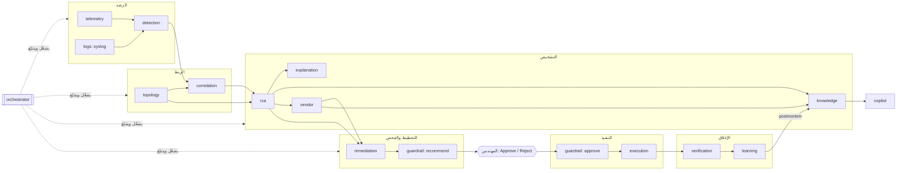

# وكلاء RootIQ (Multi-Agent) — الدليل الكامل

> **الفكرة في سطر:** بدل «نموذج ذكاء اصطناعي واحد يفعل كل شيء»، RootIQ فيها **16 وكيلًا متخصصًا**، لكل وكيل مهمة واحدة وأدوات محدودة وأثر (trace) يمكن تدقيقه — وقرار التنفيذ **دائمًا** بيد المهندس.
>
> الكود: `backend/app/agents/` · الواجهة: صفحة **Agents** (أيقونة الروبوت) · الاختبارات: `backend/tests/test_agent*.py` `test_guardrail.py` `test_copilot.py` `test_rag.py` `test_knowledge_base.py` `test_vendor_agents.py`

---

## 0. الجدول السريع

| # | الوكيل (`id`) | الطبقة | مستوى الاستقلالية | الفائدة في جملة | LLM؟ |
|---|---|---|---|---|---|
| 1 | `orchestrator` المنسّق | إشراف | ينسّق | لا يوقف فشلُ وكيلٍ واحد الحادثةَ كلها، والمسار كله قابل للتتبع | لا |
| 2 | `telemetry` القياسات | رصد | يراقب | يمسك البيانات السيئة/القديمة قبل أن تصير حادثة كاذبة | لا |
| 3 | `detection` الكشف | رصد | يراقب | يكتشف العطل خلال ثانية بدون بيانات تدريب | لا |
| 4 | `logs` السجلات (Syslog) **جديد** | رصد | يراقب | يلتقط سقوط منفذ من سجل الجهاز نفسه، بصيغ Cisco/Juniper/Arista/Huawei/MikroTik… | لا |
| 5 | `topology` الطوبولوجيا | استدلال | يراقب | يجيب «ماذا ينكسر لو بطؤ هذا الرابط؟» من الرسم لا من التخمين | لا |
| 6 | `vendor` معرفة المصنّعين **جديد** | معرفة | ينصح | يعرف مصنّع كل جهاز ونظامه وإصداره ويعطي أوامر الفحص بلغته (قراءة فقط) | لا |
| 7 | `correlation` الربط | استدلال | يراقب | عشرات التنبيهات → حادثة واحدة (~96% تقليل ضجيج) | لا |
| 8 | `rca` السبب الجذري | استدلال | ينصح | أفضل 3 أسباب بأدلة ونسبة ثقة، ويقول «لا أعرف» عند الشك | لا |
| 9 | `explanation` الشرح | استدلال | ينصح | شرح عربي/إنجليزي بلا أي رقم مختلق | اختياري |
| 10 | `knowledge` المعرفة (RAG) | معرفة | يراقب | يسترجع حوادث سابقة وخطوة الـrunbook وكتالوج المصنّعين والمشاكل مع المصدر | لا |
| 11 | `copilot` المساعد | معرفة | ينصح | اسأل بدل التنقل بين اللوحات (وعن أوامر أي مصنّع)، وكل ادعاء له مصدر | اختياري |
| 12 | `remediation` مخطِّط المعالجة | إجراء | ينصح | المهندس يوافق على خطة محددة قابلة للتراجع (مع أوامر مصنّع الجهاز المرجعية) | لا |
| 13 | `guardrail` الحماية | حوكمة | ينسّق | «لا شيء يُنفَّذ بدون مهندس» قاعدة في الكود، وأوامر التشخيص للقراءة فقط | لا |
| 14 | `execution` التنفيذ | إجراء | ينفّذ بموافقة فقط | المكوّن الوحيد الذي يلمس المختبر، ويرفض بدون حكم Guardrail | لا |
| 15 | `verification` التحقق | إجراء | يراقب | التعافي يُثبَت بالأرقام لا يُفترض | لا |
| 16 | `learning` التعلّم وما بعد الحادثة | تعلّم | ينصح | كل حادثة تجعل التالية أسرع، وتقرير جاهز للفريق | لا |

**14 من 16 وكيلًا حتمية (Deterministic) بالكامل.** الـLLM يدخل فقط في `explanation` و`copilot`، وبشرطين: (1) مفتاح API مفعّل، (2) كل رقم في الجواب موجود في الحقائق المقاسة — وإلا يُرفض الجواب ويُستخدم القالب.

---

## 1. لماذا Multi-Agent؟ (القرارات التصميمية)

### 1.1 ما الذي يجعل الشيء «وكيلًا» عندنا
وحدة تحقق كل ما يلي:
1. **مهمة واحدة** واضحة (مكتوبة في `roster.py`: mission / benefit).
2. **مدخلات ومخرجات صريحة** (لا تقرأ حالة عشوائية).
3. **أدوات محدودة** (قائمة `tools`) — لا shell حر.
4. **أثر (Trace Step)** لكل عمل مهم: من، ماذا، كم مللي ثانية، ماذا قرر، لماذا.
5. **خطة بديلة** عند الفشل أو التعطيل (انظر §3.4).

### 1.2 لماذا لا «وكلاء LLM مستقلون»؟
| السؤال | وكلاء LLM حرة | نهجنا (Deterministic first) |
|---|---|---|
| الدقة | قد تهلوس أرقامًا/أوامر | الأرقام من القياسات فقط، والـLLM يعيد الصياغة فقط |
| قابلية التدقيق | صعب إعادة إنتاج القرار | نفس المدخلات → نفس النتيجة، والدرجات مفصّلة |
| الأمان | قد «تقرر» تنفيذ أمر | لا وكيل ينفّذ إلا بعد موافقة إنسان + حكم Guardrail |
| بدون إنترنت / بدون مفتاح | لا يعمل | كل شيء يعمل، والـLLM ميزة إضافية |
| الاستضافة المحلية (سيادة البيانات) | يرسل بيانات للخارج | افتراضيًا لا يخرج أي شيء |

### 1.3 ثلاث قواعد ذهبية
1. **Advisor ≠ Actor:** الوكلاء ينصحون (`advise`) أو يراقبون (`observe`). الوحيد الذي يغيّر شيئًا هو `execution`، وبعد بوابة الإنسان.
2. **Human gate:** أي `approve/reject` يجب أن يأتي من **اسم إنسان**؛ `system`, `agent:*`, `copilot`, `orchestrator`… مرفوضة (HTTP 403).
3. **Fail closed:** لو تعطل `guardrail` نفسه (استثناء) → لا تنفيذ. وإن غاب حكمه → `execution` يرفض.

---

## 2. الخريطة الكاملة



### ترتيب الخطوات الفعلي في الحادثة (من تشغيل حقيقي لهذا البناء)

| الوقت | الوكيل.العمل | النتيجة |
|---|---|---|
| +0.0s | `correlation.open_incident` | أول عرَض `link-r1-sw1.if_out_discards_rate` — فُتحت INC-0001 |
| +10.0s | `telemetry.assess_sources` | 3 مصادر حديثة، جودة البيانات 100% |
| | `correlation.collapse_storm` | 39 عرَضًا خامًا في 3 عناصر ← حادثة واحدة (97% تقليل ضجيج) |
| | `topology.scope_dependencies` | 3 عناصر تؤثر على خدمتين: `svc-dns`, `svc-web` |
| | `rca.rank_causes` | السبب: R1 Gi0/0 → SW1 Gi0/1 بثقة 90%، والثاني Internal DNS (0.39) |
| | `detection.multivariate_score` | skipped — لا يوجد نموذج Isolation Forest مدرّب (اختياري) |
| | `explanation.write_explanation` | شرح قالبي EN+AR |
| | `knowledge.retrieve_context` | 0 حادثة مشابهة، 3 مراجع |
| | `vendor.enrich_incident` | 2/2 جهاز مُعرَّف (R1 و SW1: Cisco IOS)، نمطان معروفان — الأول: Link congestion |
| | `orchestrator.investigate` | اكتمل التشخيص |
| | `remediation.plan_remediation` | `PB-LINK-QOS` مخاطرة low، 3 خطوات، تراجع معرّف، وأوامر فحص Cisco المرجعية لـGi0/0 و Gi0/1 |
| | `guardrail.policy_recommend` | فحوص السياسة نجحت (منها `vendor_commands_read_only`) |
| | `orchestrator.handoff_to_human` | **بانتظار المهندس — لا شيء سيعمل قبله** |
| بعد الموافقة | `guardrail.policy_approve` ← `execution.execute_playbook` | تنفيذ عبر المحاكي/وكيل المختبر المحصور |
| بعد التعافي | `verification.verify_recovery` ← `learning.close_out` ← `orchestrator.incident_closed` | تحقق 3/3 + تقرير + تحديث التاريخ |

> عند محاولة موافقة من `system` أو `agent:copilot` يظهر `guardrail.policy_approve` بحالة **denied** ويُسجَّل في Audit (`guardrail_denied`) — ولا يُنفَّذ شيء.

---

## 3. نموذج التشغيل (Runtime)

### 3.1 المكوّنات
| الملف | الدور |
|---|---|
| `agents/roster.py` | مصدر الحقيقة لوصف كل وكيل (bilingual) + مخطط الخط `FLOW/EDGES` |
| `agents/base.py` | `AgentSpec` · `TraceStep` · `TraceStore` · `Agent.step()` (يقيس الزمن، يسجل الأثر، يبثّه عبر WebSocket) |
| `agents/runtime.py` | `AgentRuntime`: ينشئ الوكلاء الـ16، يملك الـTraceStore ومفاتيح التعطيل، ويوفّر `roster()/flow()/health()` |
| `agents/orchestrator.py` | يشغّل التشخيص، `safe()` = مهلة + بديل، `handoff()` و`closed()` |
| `agents/playbooks.py` | كتالوج الـplaybooks المسموحة (القائمة البيضاء الوحيدة) |

### 3.2 بنية Trace Step
```json
{
  "id": "AS-000012", "agent": "rca", "action": "rank_causes", "incidentId": "INC-0001",
  "status": "ok | error | skipped | denied", "startedAt": "2026-09-28T19:43:10Z",
  "durationMs": 0.25, "summary": "top cause R1 Gi0/0 → SW1 Gi0/1 — confidence 90%",
  "data": { "confidence": 0.9, "candidates": [ ... ] }, "decision": "root_cause_selected"
}
```
يُبثّ كل Step على WebSocket بنوع `agent_step`، وتقرأ الواجهة السجل عبر `GET /api/agents/trace`.

### 3.3 مفاتيح التعطيل (Kill switches)
- `POST /api/agents/{id}/toggle` `{ "enabled": false, "actor": "Ahmed" }` — يُسجَّل في Audit.
- **قابلة للتعطيل:** `telemetry` `logs` `vendor` `explanation` `knowledge` `copilot` `verification` `learning`.
- **غير قابلة للتعطيل (403):** `orchestrator` `detection` `topology` `correlation` `rca` `remediation` `guardrail` `execution` — لأن تعطيلها إما يكسر التشخيص أو يُضعف الأمان.

### 3.4 جدول التدهور الآمن (ماذا يحدث عند الفشل/التعطيل)

| الوكيل | إذا عُطّل أو فشل أو تجاوز المهلة | أثر ذلك على الحادثة |
|---|---|---|
| `telemetry` | تُتخطى خطوة `assess_sources` (الفحص السريع للأحداث يبقى) | لا سياق حداثة للمصادر |
| `correlation.storm_summary` | تُتخطى الخطوة | الربط نفسه (`pick`) لا يتأثر |
| `topology.scope` | تُتخطى | RCA يكمل (يستخدم الرسم مباشرة) |
| `detection.multivariate` | تُتخطى | لا دليل Isolation Forest (كان داعمًا فقط) |
| `explanation` | **يُستخدم القالب** (`template`) | شرح EN/AR جاهز |
| `knowledge` | لا «حوادث مشابهة» ولا مراجع؛ والـCopilot لا يسترجع | الحادثة تكتمل |
| `rca` | الاستثناء يصعد؛ الحادثة تبقى `investigating` ويُسجَّل الخطأ | **حرج** — لذلك لا يُعطَّل |
| `guardrail` | أي استثناء ← الموافقة تفشل (fail closed) | لا تنفيذ |
| `execution` | `approvalStatus = failed` + Audit `execute_failed` | لا تعافٍ تلقائي |
| `vendor` | لا `vendorContext` ولا `vendorCommands` في الخطة (تبقى الخطة الأساسية كاملة) | الحادثة والموافقة يكملان |
| `logs` | `POST /api/syslog` ← 503؛ القياسات الدورية تبقى | لا سقوط منفذ من السجلات |
| `verification` | `verification = null` | الإغلاق يكمل |
| `learning` | يُسجَّل `history` فقط بدون تقرير | الإغلاق يكمل |
| `copilot` | `/api/copilot/ask` ← 503 | لا أثر على الحادثة |

المهلة الافتراضية لكل وكيل: `AGENT_TIMEOUT_S=8`.

---

## 4. الوكلاء واحدًا واحدًا

> قالب كل قسم: **الفائدة ← المهمة ← المدخلات/المخرجات ← كيف يعمل ← ما يحتاجه ← الضوابط ← عند الفشل ← الكود والاختبار.**

### 4.1 `orchestrator` — المنسّق
- **الفائدة:** الحادثة لا تتوقف لأن LLM بطيء أو ملف نموذج مفقود؛ والمهندس/الحكم يرى مسارًا مرتبًا بدل صندوق أسود.
- **المهمة:** تشغيل التشخيص بترتيب ثابت، تطبيق مهلة وبدائل، ثم **تسليم الحالة للإنسان**.
- **المدخلات:** حادثة فيها أعراض (`IncidentState`) + قائمة الخدمات المتأثرة.
- **المخرجات:** `Investigation` (top, confidence, root, candidates, impactPath, explanation, knowledge…) + خطوات `investigate` و`handoff_to_human` و`incident_closed`.
- **كيف يعمل:** `investigate()` يستدعي بالترتيب: `telemetry.incident_context` → `correlation.storm_summary` → `topology.scope` → `rca.rank` (حرج) → `topology.impact` → `detection.multivariate` → `explanation.write` → `knowledge.related` → `vendor.enrich`. كل استدعاء اختياري يمر عبر `safe()`: يتخطى إن كان الوكيل معطّلًا، ويقطع عند المهلة، ويبتلع الخطأ (الوكيل سجّله بنفسه).
- **يحتاج:** `AgentRuntime` + `AGENT_TIMEOUT_S`.
- **الضوابط:** لا يملك أداة `approve` ولا `execute`؛ لا يُعطَّل.
- **عند الفشل:** فشل RCA يصعد كاستثناء (لا تشخيص بدون سبب).
- **الكود/الاختبار:** `agents/orchestrator.py` — `test_agent_flow.py::test_diagnosis_runs_agents_in_order_and_stops_at_the_human`, `::test_slow_knowledge_agent_times_out_without_blocking_the_incident`, `::test_disabled_optional_agents_degrade_gracefully`.

### 4.2 `telemetry` — وكيل القياسات
- **الفائدة:** رقم مستحيل (استخدام 140%) أو وحدة خاطئة أو مصدر صامت لا يصير سببًا جذريًا مزيفًا.
- **المهمة:** التحقق من كل حدث وارد وتتبع حداثة كل مصدر.
- **المدخلات:** `Event` المطبَّع (`POST /api/events`).
- **المخرجات:** أعلام جودة (`non_finite`, `out_of_range`, `negative_value`, `unit_mismatch`, `duplicate`)، خريطة الحداثة، `qualityScore`.
- **كيف يعمل:** `observe(ev)` على المسار الساخن (بلا Trace لتفادي الضجيج): يتحقق من القيمة المنتهية، ومدى النسب المئوية [0..100]، وعدم سلبية الـms، ومطابقة الوحدة، والتكرار. `NaN/Inf` ← رفض 422. قبل RCA: `incident_context()` يتحقق أن مصادر الحادثة حديثة (أقل من 20 ث) وإلا يحذّر «ثقة RCA قد تكون مبالغًا بها».
- **يحتاج:** جدول `METRIC_UNIT` في `agents/telemetry.py`.
- **الضوابط:** لا يعدّل القيم؛ يُعلّم ولا يحذف بصمت (عدا غير المنتهي).
- **عند التعطيل:** تُتخطى خطوة السياق فقط.
- **الاختبار:** `test_agent_flow.py::test_telemetry_agent_flags_bad_data_and_rejects_non_finite`.

### 4.3 `detection` — وكيل الكشف
- **الفائدة:** كشف في ~ثانية بدون بيانات تدريب، ونموذج متعدد المتغيرات لا يستطيع اختراع سبب.
- **المهمة:** تحويل تدفق المقاييس إلى شذوذات.
- **المدخلات:** `(entity, metric, value, ts)`.
- **المخرجات:** `Anomaly` + مستوى تنبيه خام + دليل multivariate.
- **كيف يعمل:** (1) عتبة ثابتة من `thresholds.py`؛ (2) z-score على EWMA **لا يعمل إلا بعد** تجاوز عتبة ثابتة (يمنع حوادث كاذبة)؛ (3) Isolation Forest **دليل داعم فقط** إن وُجد `data/models/iforest.joblib` وكانت الدرجة > 0.6. تعلّم الـbaseline يتجمد أثناء الشذوذ كي لا «يتعوّد» على العطل.
- **يحتاج:** ~20 عينة سليمة للإحماء؛ النموذج اختياري.
- **الضوابط:** لا يُعطَّل (المسار الساخن يعتمد عليه)؛ IF لا يغيّر الترتيب.
- **الكود:** `agents/detection.py` + `intelligence/{detector,baseline,anomaly,thresholds}.py` — اختبارات `test_detector.py` `test_baseline.py` `test_thresholds.py`.

### 4.4 `topology` — وكيل الطوبولوجيا
- **الفائدة:** إجابات «من يتأثر؟» من الرسم؛ وتظليل مسار السبب ومسار التأثر على الخريطة.
- **المهمة:** امتلاك رسم الاعتماديات (NetworkX): الخدمات ↔ الروابط ↔ الأجهزة، upstream/downstream، ونطاق التأثر، وكشف الانحراف.
- **المدخلات:** معرّفات عناصر؛ جيران CDP/LLDP المرصودون.
- **المخرجات:** الخدمات المتأثرة، `impactPath`، `path(a,b)`، تقرير انحراف `reconcile`، وطرفا كل رابط (جهاز + منفذ) لتستعملهما `vendor` و`logs`.
- **تعديل (دعم المصنّعين):** حقول اختيارية في عقدة الطوبولوجيا: `vendor` (تلميح نصي حر مثل «Juniper EX4300»)، `sysDescr`، `sysObjectId`، `os` — يقرؤها `vendor` لتحديد المصنّع/النظام/الإصدار. بدونها يبقى كل شيء يعمل.
- **كيف يعمل:** `scope()` قبل RCA يحسب سلاسل اعتماد كل خدمة متأثرة؛ `impact(root)` بعد RCA يحسب ما بعد السبب؛ `reconcile()` يقارن (device, port, neighbor, neighborPort) بالمعلن في `configs/topology.json` ويُرجع `unexpected` و`missing`.
- **يحتاج:** `configs/topology.json` (المنافذ تُعرَّف هناك فقط) + نقطة vantage.
- **الضوابط:** قراءة فقط؛ لا يخترع معرّفات.
- **API:** `POST /api/topology/reconcile`.
- **الاختبار:** `test_agent_flow.py::test_topology_agent_impact_and_drift`.

### 4.5 `correlation` — وكيل الربط
- **الفائدة:** المهندس يرى **حادثة واحدة** بدل عاصفة تنبيهات (مقاس: ~96% تقليل).
- **المهمة:** ضم الأعراض المترابطة طوبولوجيًا ضمن نافذة 120 ث.
- **المدخلات:** `Anomaly` + الحوادث المفتوحة.
- **المخرجات:** الحادثة المناسبة (أو فتح جديدة) + `noiseReduction = 1 − 1/raw`.
- **كيف يعمل:** `pick()` يستخدم `Correlator.related`: نفس العنصر، أو downstream، أو تشارك خدمة، أو مسافة ≤ 3 قفزات. تُسجَّل خطوتان فقط: `open_incident` و`collapse_storm` (لا Trace لكل عرَض).
- **الضوابط:** لا يضم أعراضًا غير مترابطة؛ النافذة محدودة.
- **الاختبار:** `test_correlate.py` + تدفق `test_agent_flow.py`.

### 4.6 `rca` — وكيل السبب الجذري
- **الفائدة:** أفضل 3 مرشحين مع الأدلة وتفكيك الدرجة؛ وعند الثقة < 55% يقول «يحتاج تحقيقًا».
- **المهمة:** ترتيب الأسباب بدرجة موزونة قابلة للتفسير + الإجابة عن «لماذا ليس X؟».
- **المخرجات:** `Candidate[]` + `confidence` + `why_not()`.
- **كيف يعمل:** `score = 0.30·metric_anomaly + 0.25·dependency_overlap + 0.20·temporal_proximity + 0.15·blast_radius + 0.10·historical_support`. عنصر يقع **بعد** عنصر شاذ آخر تُضرب درجته في 0.5 (العرَض ليس سببًا). الثقة = الدرجة الأولى مخصومًا منها فرق قليل مع الثانية.
- **`why_not(entity)`:** 5 أنواع جواب: `is_root` · `suppressed` (يذكر العنصر السابق) · `lower_score` (يذكر أكبر مكوّن فرق) · `below_top3` · `no_symptoms`.
- **الضوابط:** حتمي 100%؛ لا LLM في الترتيب.
- **الكود/الاختبار:** `agents/rca.py` + `intelligence/rca.py` — `test_rca.py`, `test_scenarios.py` (السيناريوهات الثلاثة ⇒ الجذر الصحيح), `test_copilot.py::test_why_not_uses_the_rca_reasoning`.

### 4.7 `explanation` — وكيل الشرح
- **الفائدة:** شرح مقروء بالعربية والإنجليزية للـNOC بدون رقم مختلق.
- **كيف يعمل:** قوالب EN/AR لكل نوع سبب (link / svc-dns / server) تُملأ من حقائق مقاسة. إن فُعّل LLM: يُطلب منه إعادة الصياغة بجملتين؛ ثم `grounded()` يرفض أي رقم غير موجود في الحقائق ← الرجوع للقالب.
- **يحتاج:** لا شيء للوضع الحتمي؛ مفتاح Provider فقط إن `LLM_ENABLED=1`.
- **عند الفشل/التعطيل:** القالب (`source: template`).
- **الاختبار:** `test_explain.py`, `test_agent_flow.py::test_disabled_optional_agents_degrade_gracefully`.

### 4.8 `knowledge` — وكيل المعرفة (RAG)
- **الفائدة:** «هذه الحادثة شبيهة بـINC-0007 وهذه خطوة الـrunbook» — في أجزاء من الثانية وبمصدر.
- **المصادر المفهرسة:** كتالوج المصنّعين (`kind=vendor`: ملف لكل مصنّع، و`vendor-cmd`: جدول أوامر لكل نظام) وكتالوج المشاكل (`kind=problem`) — وزنهما 0.9 كي لا يطغيا على وثائق المشروع؛ ثم `docs/*.md`، `README.md`، `RootIQ_Daily_Plan.md` (وزنه 0.6 لضخامته)، `configs/topology.json` (وصف نصي لكل جهاز/رابط/خدمة)، العتبات، الـplaybooks الثلاثة، `lab/configs/*` (بعد حجب الأسرار)، الحوادث الحية، وتقارير ما بعد الحادثة.
- **كيف يعمل:** تقطيع Markdown بحسب العناوين (≤ 900 حرف) ← تنظيف وحجب أسرار ← TF-IDF (كلمات + ثنائيات، `sublinear_tf`، كلمات وقف EN/AR، تطبيع عربي: تشكيل/همزات/ياء/تاء مربوطة/«ال») ← تشابه جيب التمام ← عتبة `RAG_MIN_SCORE=0.10`.
- **`related(inc)`:** بعد RCA يبحث عن حوادث/تقارير مشابهة (استبعاد نفس الحادثة) + مراجع (docs/playbook/topology) ويضعها في `incident.knowledge` (تظهر في لوحة الحادثة).
- **الضوابط:** الأسرار محجوبة قبل الفهرسة؛ المقاطع التي تحاول توجيه النموذج (عبارات أوامر مضمَّنة في النص) تُعلَّم `suspicious` ولا تصل للجواب؛ لا نتائج دون العتبة.
- **يحتاج:** `scikit-learn`؛ مجلد `docs/` (تنسخه Dockerfiles الآن).
- **الفهرس يُبنى** في الخلفية عند الإقلاع (`asyncio.to_thread`) كي لا يبطّئ أول حادثة. `POST /api/knowledge/reindex` لإعادة البناء.
- **الاختبار:** `test_rag.py` (تقطيع، حجب، حقن، عربي، بحث، عدم تسريب الأسرار من المستودع الحقيقي).

### 4.9 `copilot` — وكيل المساعد
- **الفائدة:** سؤال بالعربية أو الإنجليزية بدل التنقل: «لماذا ليس DNS؟»، «ماذا أفعل؟»، «كم زمن الوصول للسبب؟».
- **النوايا (Intents):** `incident_summary` · `why_cause` · `why_not` · `impact` · `recommend` · `audit` · `kpi` · `similar` · `status` · `action_request` (يرفض بلطف) · `vendor_help` (أوامر/مشاكل/مصنّعون من قاعدة المعرفة — حتمي حرفي ولا يُعاد صياغته بالـLLM) · `docs` (RAG عام).
- **كيف يعمل:** يكشف اللغة ← يصنّف النية (كلمات مطبّعة EN/AR) ← يحدد العنصر المذكور (`DNS`, `APP-01`, `R1 Gi0/0`…) ← يجمع حقائق من قراءات حية (حادثة/طوبولوجيا/Audit/KPIs) ← جواب حتمي مع مصادر `[1] [2]`. إن فُعّل LLM: يعيد الصياغة بشرطين: كل رقم مؤسَّس على (الحقائق + السياق + السؤال) ووجود استشهاد `[n]` لسؤال الوثائق؛ وإلا يبقى الجواب الحتمي.
- **للقراءة فقط بالبناء:** لا توجد أداة `approve/reject/execute/inject/toggle` (قائمة `TOOLS`)، واختبار يفحص كود الملف حرفيًا. طلب «وافق على الإجراء» ← يرد أنه للقراءة فقط ويحيل لزرّي Approve/Reject.
- **مقاومة الحقن:** مقاطع الوثائق **بيانات**؛ المشبوهة تُستبعد وتظهر في `warnings`؛ والسؤال نفسه إن بدا كتعليمات يُنبَّه عليه.
- **يقول «لم أجد»** بدل التخمين (`confidence: none`).
- **API:** `POST /api/copilot/ask` `{question, incidentId?, lang?}` ← `{answer, intent, confidence, source, sources[], facts, warnings[]}`.
- **الاختبار:** `test_copilot.py` (تصنيف EN/AR، القراءة فقط، حدود LLM، تسميم وثيقة…).

### 4.10 `remediation` — مخطِّط المعالجة
- **الفائدة:** الموافقة على **خطة**: خطوات، أثر، تراجع، ومعيار نجاح رقمي.
- **كيف يعمل:** يختار Playbook واحدًا لنوع السبب (link → `PB-LINK-QOS`، svc-dns → `PB-DNS-RESTART`، server → `PB-SERVER-KILL-RUNAWAY`) ويملأ: `preconditions`, `steps` (read/change/verify + أمر توضيحي), `rollback`, `verification` (معايير رقمية مثل `link_utilization < 70`), `blastRadius`, `riskFactors`, `labImplementation`. ترتفع المخاطرة درجة إن كانت الثقة < 55%.
- **تعديل (دعم المصنّعين):** إن وُجد `vendorContext` يُضيف للخطة `plan.vendorCommands` = {المشكلة المطابقة، الأجهزة، `diagnose` (أوامر قراءة لكل جهاز حسب مصنّعه ونظامه)، `fixes` (أوامر مرجعية تحتاج موافقة)، `executable: false`}. هذه **نص مرجعي للمهندس** ولا ينفّذها RootIQ؛ ما يُنفَّذ بعد الموافقة يبقى الـplaybook الأبيض.
- **الضوابط:** من الكتالوج فقط؛ `requiresApproval=true`, `autoExecutable=false` دائمًا.
- **ملاحظة صدق:** ما ينفّذه وكيل المختبر فعليًا endpoint ثابت لكل سيناريو (مثلًا إيقاف iperf3 لسيناريو الازدحام)؛ حقل `labImplementation` يذكر ذلك صراحة. تطبيق QoS الحقيقي عبر Netmiko مسار إنتاجي لاحق (انظر BLUEPRINT §9).
- **الاختبار:** `test_agent_flow.py::test_all_three_scenarios_get_a_matching_playbook`.

### 4.11 `guardrail` — وكيل الحماية
- **الفائدة:** القاعدة «لا تنفيذ بدون مهندس» مطبّقة في الكود وتُسجَّل كل مخالفة.
- **السياسات:**

| السياسة | المراحل | المستوى | ماذا تفحص |
|---|---|---|---|
| `human_decider` | approve, reject | **block** | اسم بشري؛ يُرفض الفارغ و`system` و`agent:*` و`orchestrator` و`copilot` و`AI`… |
| `whitelist` | recommend, approve | **block** | `actionType` ضمن كتالوج الـplaybooks |
| `requires_human` | recommend | **block** | الخطة تتطلب موافقة وغير قابلة للتنفيذ الآلي |
| `action_pending` | approve | **block** | فقط إجراء `pending` يُوافَق عليه (يمنع الموافقة المزدوجة) |
| `incident_state` | approve | **block** | الحادثة ليست resolved/approved |
| `rate_limit` | approve | **block** | ≤ `GUARDRAIL_MAX_EXECUTIONS` (5) تنفيذات كل 5 دقائق |
| `lab_scope` | approve (وضع live) | **block** | `LAB_AGENT_URL` عنوان خاص/loopback أو اسم داخلي — عزل المختبر |
| `execution_switch` | approve (live) | warn + **Dry run** | `ROOTIQ_EXECUTION_ENABLED=0` ← تُسجَّل الموافقة ولا يُغيَّر شيء |
| `vendor_commands_read_only` | recommend, approve | **block** | كل أمر تشخيص في `plan.vendorCommands` يبدأ بفعل قراءة معروف ولا يحوي فعل تغيير، و`executable=false`، وكل إصلاح `needsApproval` |
| `low_confidence` | recommend, approve | warn | الثقة < 55% |
| `blast_radius` | recommend, approve | warn | 7+ عناصر downstream |

- **مخرجاته:** `Verdict {allowed, execute, warnings, checks[]}` في Trace (`policy_recommend/approve/reject`)؛ عند الرفض يُكتب Audit `guardrail_denied` وتُرجع الواجهة 403.
- **الضوابط:** لا يُعطَّل.
- **الاختبار:** `test_guardrail.py` (عشرات الحالات البارامترية) و`test_agent_flow.py::test_agents_and_system_cannot_approve_and_nothing_executes`.

### 4.12 `execution` — وكيل التنفيذ
- **الفائدة:** نقطة اتصال وحيدة بالمختبر، ترفض العمل بلا موافقة ولا حكم.
- **كيف يعمل:** يشترط `approvalStatus == approved` **و** `verdict.allowed`. في `sim`: `Simulator.remediate()`. في `live`: `lab_client.call('/remediate/<scenario>')` (وكيل المختبر يشغّل أوامر ثابتة فقط). إن كان مفتاح التنفيذ مغلقًا: **Dry run** (يسجل الأوامر التي كانت ستُنفَّذ). بعد التنفيذ يسجّل في حد المعدل.
- **عند الفشل:** `approvalStatus = failed` + Audit `execute_failed`.
- **الضوابط:** لا shell حر؛ لا يُعطَّل.
- **الاختبار:** `test_agent_flow.py` — `..._reject_then_approve_executes_once...`, `..._live_mode_dry_run...`, `..._live_mode_executes_through_the_whitelisted_lab_agent`, `..._execution_agent_refuses_without_approval_or_verdict`.

### 4.13 `verification` — وكيل التحقق
- **الفائدة:** «تعافى» = أرقام محققة (مثلًا `utilization 26 < 70`) لا مجرد مرور 15 ثانية.
- **كيف يعمل:** يقرأ `plan.verification` ويقارن بآخر قيم `StateStore`؛ النتيجة `verified | partial | unverified | no_criteria`. في حالتي partial/unverified يقترح مراجعة التراجع/التصعيد.
- **الضوابط:** لا يغيّر شيئًا ولا يمنع الإغلاق للأبد. بعد مؤقّت الـ15 ثانية الأصلي تنتظر الحادثة تحقق المعايير حتى مهلة `VERIFY_GRACE_S` (30 ث افتراضيًا) ثم تُغلق ويُسجَّل `unverified` إن لم تتحقق. فخدمة بطيئة التعافي (مثل DNS في المحاكاة) لا تظهر كنجاح كاذب.
- **الواجهة:** قسم «Recovery verification» في لوحة الحادثة.
- **الاختبار:** `test_agent_flow.py::test_recovery_is_verified_and_a_postmortem_is_written_and_learned`.

### 4.14 `learning` — وكيل التعلّم وما بعد الحادثة
- **الفائدة:** الحادثة التالية من نفس السبب ترتفع ثقتها («شوهد N مرات»)، ويحصل الفريق على تقرير جاهز.
- **كيف يعمل:** عند الإغلاق: يبني Postmortem (ملخص EN/AR، السبب والمرشحون، الأثر، الأدلة، Timeline، القرار ومن اتخذه، التحقق، KPIs: TTD/TTRCA/TTR/noise، أثر الوكلاء، ما سار جيدًا، تحسينات مقترحة حسب نوع السبب) ← يكتبه `data/postmortems/<id>.md` ← يحدّث `History` (`historical_support`) ← يفهرسه في `knowledge` (فتظهر الحادثة كمشابهة لاحقًا).
- **الضوابط:** يكتب فقط في `data/postmortems`؛ **لا يغيّر الأوزان أو العتبات تلقائيًا**.
- **API:** `GET /api/incidents/{id}/postmortem`.
- **الاختبار:** `test_agent_flow.py::test_second_incident_finds_the_first_as_similar`.

### 4.15 `logs` — وكيل السجلات (Syslog) **جديد**
- **الفائدة:** سقوط منفذ يُلتقط من سجل الجهاز نفسه خلال ثانية، على أي مصنّع تغطيه القاعدة، لا من الاستطلاع الدوري فقط.
- **المهمة:** تحويل أسطر syslog الخام إلى أحداث موحّدة عبر أنماط المصنّعين في قاعدة المعرفة، وإدخال أحداث حالة الرابط في الـpipeline.
- **المدخلات:** `POST /api/syslog` `{device, vendor?, lines[≤200]}` (نفس رمز الإدخال `X-RootIQ-Token` ونفس حد المعدل كـ`/api/events`).
- **المخرجات:** لكل سطر `{parsed, vendor, event, interface, state, link, pushed, alsoMatches}` + حدث `syslog_link_down` (1 = سقط، 0 = عاد) على **الرابط** المقابل للمنفذ.
- **كيف يعمل:** تنظيف السطر (حذف رموز التحكم، ≤ 1000 حرف) ← تلميح المصنّع من الطوبولوجيا (أو من الطلب) ← `parse_syslog` (أنماط 9 مصنّعين: Cisco IOS/NX-OS، Junos، Arista، Huawei VRP، MikroTik، Extreme، Linux، FortiOS (سجلات الأحداث)، وArubaOS-Switch (`port X is now off-line`)) ← توحيد اسم المنفذ (`GigabitEthernet0/0` = `Gi0/0`) ← `port_to_link` ← `pipeline.ingest`. الأحداث غير الخاصة بالمنافذ (OSPF/BGP/STP، وتغيير الإعداد `config_change` مثل `%SYS-5-CONFIG_I` عند Cisco/Arista و`UI_COMMIT` عند Junos) تُوحَّد وتُخزَّن ولا تفتح حادثة بمفردها.
- **الصيغ المشتركة:** بعض الصيغ تخص أكثر من مصنّع (مثل `%LINEPROTO-5-UPDOWN` عند Cisco وArista)؛ يُفضَّل تلميح الجهاز في الطوبولوجيا، وإلا يُختار الأكثر شيوعًا مع إرجاع `alsoMatches`.
- **الضوابط:** ما لا يُعرف يُعدّ `unparsed` ولا يُخمَّن؛ منفذ غير موجود في الطوبولوجيا لا يُرسل للـpipeline؛ لا يفتح حادثة إلا «سقوط» على رابط معروف.
- **يحتاج:** أن تُضبط الأجهزة لإرسال syslog إلى المجمّع/الـAPI (المجمّع الحالي لا يشغّل مستمع UDP 514 بعد — انظر §10).
- **الكود/الاختبار:** `agents/logs.py`, `api/vendors.py` — `test_vendor_agents.py` (`test_cisco_link_down_line_becomes_a_link_event_and_opens_an_incident` وأخواته).

### 4.16 `vendor` — وكيل معرفة المصنّعين **جديد**
- **الفائدة:** حادثة «أخطاء CRC» نفسها تحصل على أوامر Cisco IOS-XE أو Junos أو Arista EOS أو Huawei VRP أو MikroTik أو Linux الصحيحة، فلا يترجم المهندس بين واجهات الأوامر.
- **المهمة:** (1) التعرّف على مصنّع/نظام/إصدار/موديل كل جهاز من `sysObjectID` و`sysDescr` وتلميح نصي؛ (2) مطابقة الحادثة مع أنماط مشاكل معروفة (25 نمطًا: ازدحام، CRC، duplex، flapping، err-disabled، STP، loop، MTU، LACP، OSPF/BGP، CPU/ذاكرة، حرارة/مراوح، PoE، بصريات، DHCP/DNS، NTP، SNMP، EoL…)؛ (3) توفير أوامر الفحص (قراءة فقط) وأوامر الإصلاح المرجعية (تحتاج موافقة) بلغة كل جهاز.
- **المدخلات:** سبب جذري + المقاييس الشاذة في الحادثة + هوية الأجهزة من الطوبولوجيا.
- **المخرجات:** `incident.vendorContext = {rootEntity, kind, devices[], problems[{id,title,causes,diagnose[],fixes[],verify}], known}`.
- **كيف يعمل:** `devices_for(root)` (رابط ← طرفاه مع المنفذ؛ خدمة ← مضيفها؛ جهاز ← نفسه) ← `identify` لكل جهاز ← `problems_for(metrics, kind)` (مقاييس + نوع السبب، ويُستبعد ما لا ينطبق: خادم لا يُخبَر بحلقة L2) ← `checks_for` / `fix_commands` لكل جهاز.
- **نموذج الإعداد وأسلوب الأوامر (جديد):** لكل جهاز يُرجع `vendorContext.devices[].configModel` = كيف يُطبَّق التغيير ويُحفظ ويُتراجَع عنه (`running-startup` / `candidate-commit` / `auto-save`) مع أوامر الدخول والحفظ ونقطة الاسترجاع والتغيير الآمن (`commit confirmed`، `reload in 5`، `commit timer`) وأسلوب كتابة الأوامر — لأن أبرز اختلاف بين Cisco وJuniper وFortinet وAruba وArista هو هنا. مرجعي للمهندس ولا يُنفَّذ. تفاصيل الخمسة في [`VENDORS.md`](VENDORS.md) §3b.
- **التغطية بصراحة:** `full` (5: Cisco، Juniper، Arista، Huawei، HPE/Aruba)، `partial` (7)، `profile-only` (31 — تعريف فقط بلا أوامر). كل مصنّع له `confidence`. الموديلات على مستوى **العائلة/السلسلة** (103 عائلة) لا كل SKU. انظر `docs/VENDORS.md`.
- **الضوابط:** أوامر القراءة تمر بقائمة سماح أفعال وقائمة منع أفعال (عند التحقق من البيانات وعند حكم الـGuardrail)؛ أوامر التغيير مسموحة فقط لـ`clear_counters` و`bounce_interface` وتحتاج موافقة؛ اسم المنفذ يُتحقق منه بنمط آمن؛ مصنّع غير معروف يُذكر «غير معروف» ولا يُخمَّن.
- **API:** `GET /api/vendors` · `/api/vendors/{id}` · `/api/vendors/inventory` · `POST /api/vendors/identify` · `GET /api/problems` · `/api/problems/{id}?vendor=&os=&interface=`.
- **الكود/الاختبار:** `agents/vendor.py`, `knowledge/loader.py`, `knowledge/data/` — `test_knowledge_base.py`, `test_vendor_agents.py`.

---

## 4b. ماذا أُضيف وماذا عُدّل لدعم «كل المصنّعين» (الجواب المختصر)

| النوع | الوكيل | ما تغيّر |
|---|---|---|
| **أُضيف** | `vendor` | هوية الجهاز، مطابقة المشاكل، أوامر كل مصنّع |
| **أُضيف** | `logs` | Syslog متعدد المصنّعين ← أحداث الروابط |
| **عُدّل** | `topology` | حقول اختيارية `sysDescr/sysObjectId/os` وطرفا الرابط |
| **عُدّل** | `knowledge` | فهرسة المصنّعين والمشاكل (`vendor`, `vendor-cmd`, `problem`) |
| **عُدّل** | `copilot` | نية `vendor_help` (أوامر/مشاكل/مصنّعون، للقراءة فقط) |
| **عُدّل** | `remediation` | `plan.vendorCommands` |
| **عُدّل** | `guardrail` | سياسة `vendor_commands_read_only` |
| **عُدّل** | `orchestrator` | خطوة `vendor.enrich` بعد `knowledge` |
| **يصلح كما هو** | `telemetry` (IF-MIB محايد للمصنّع)، `detection`، `correlation`، `rca`، `explanation`، `execution`، `verification`، `learning` | لا يعرفون المصنّع أصلًا؛ يعملون على مقاييس موحّدة |
| **مقترح لاحقًا (لم يُنفَّذ)** | `lifecycle` (EoL/CVE من نشرات المصنّعين)، `config` (نسخ احتياطي/مقارنة + منفّذ Netmiko متعدد المصنّعين)، `capacity` | يحتاجون مصادر خارجية وتنفيذًا حقيقيًا على الأجهزة |

---

## 5. طبقة الـLLM (اختيارية)

| المزوّد | `LLM_PROVIDER` | المفتاح | النموذج الافتراضي (يمكن تغييره بـ`LLM_MODEL`) |
|---|---|---|---|
| Anthropic (Claude) | `anthropic` | `ANTHROPIC_API_KEY` | `claude-haiku-4-5-20251001` |
| Google Gemini | `gemini` | `GEMINI_API_KEY` | `gemini-2.5-flash` |
| Groq | `groq` | `GROQ_API_KEY` | `qwen/qwen3.8-27b` (تحقق منه فعليًا؛ `openai/gpt-oss-*` تعمل لكنها تستهلك رموزًا للتفكير) |

- التفعيل: `LLM_ENABLED=1` + المزوّد + مفتاحه. بدونها كل شيء حتمي ويعمل بلا إنترنت.
- **ما يُرسل للمزوّد:** JSON الحقائق المقاسة + السؤال + مقاطع مسترجعة (بعد حجب الأسرار). لا مفاتيح ولا إعدادات أجهزة خام. للبيئات ذات سيادة البيانات: اترك LLM مغلقًا أو اختر مزوّدًا داخليًا لاحقًا.
- **المراقبة:** `GET /api/agents` ← `health.llm.usage` = `{calls, errors, avgMs, approxTokensIn/Out}`.
- **الحماية من الهلوسة:** `grounded()` (كل رقم في الجواب ⊂ أرقام الحقائق/السياق) + شرط الاستشهاد؛ الفشل ← جواب حتمي. أسماء النماذج الافتراضية قابلة للتغيير من البيئة — تحقق منها مع المزوّد قبل الاستخدام.
- **حراسات إضافية على جواب الـCopilot:** يُرفض الجواب إن كان اعتذارًا («لا أعرف/لا تحتوي…») بينما المسودة الموثّقة تحوي الجواب، أو إن أسقط كل النسب المئوية التي في المسودة. والرسائل الثابتة (رفض التنفيذ، «لا توجد حادثة»، «لم أجد») لا تُرسل للنموذج أصلًا. وإعادة الصياغة تتم على **مسودة النظام الموثّقة** (لا يجيب النموذج من رأسه).
- **حد المعدل (429):** يدخل العميل في فترة تهدئة بقدر `Retry-After` (بحد أقصى 60 ث) فيعود كل شيء فورًا للجواب الحتمي بدل الانتظار؛ وتظهر `rateLimited/skipped/cooldownSeconds` في `health.llm.usage`. أخطاء المزوّد تُسجَّل في السجل (`rootiq.llm`) ولا تُبتلع بصمت.
- **اختُبرت بمفتاح Groq حقيقي (2026-09-28):** التفسير والـCopilot يعملان بمصدر `llm` بأرقام مؤسَّسة، 10 استدعاءات بلا أخطاء (متوسط ~1.1 ث). الملاحظات: نموذج Groq الافتراضي القديم `llama-3.3-70b-versatile` **لم يعد متاحًا** فتغيّر الافتراضي؛ وحساب Groq المجاني له حد **1000 رمز إخراج/دقيقة** لنموذج `qwen` (يحسب `max_tokens` المطلوب) فخُفِّضت `max_tokens` (120 للشرح، 220 للمساعد) وأُضيفت فترة التهدئة.

---

## 6. الـAPI وأحداث WebSocket الجديدة (إضافات فقط — `CONTRACTS.md` المجمّد لم يُعدَّل)

| الطريقة | المسار | الغرض |
|---|---|---|
| GET | `/api/agents` | قائمة الوكلاء + الحالة + المخطط + الصحة (LLM، المعرفة، جودة البيانات) |
| GET | `/api/agents/trace?incidentId=&limit=` | سجل خطوات الوكلاء |
| POST | `/api/agents/{id}/toggle` | تعطيل/تفعيل وكيل اختياري (403 للأساسي) |
| POST | `/api/copilot/ask` | سؤال للمساعد |
| GET | `/api/knowledge/search?q=&k=&kind=` | بحث مباشر في الفهرس |
| GET | `/api/knowledge/stats` | إحصاءات الفهرس |
| POST | `/api/knowledge/reindex` | إعادة بناء الفهرس |
| GET | `/api/incidents/{id}/postmortem` | تقرير ما بعد الحادثة |
| POST | `/api/incidents/{id}/acknowledge` | إقرار الاطلاع (كان في المواصفة §9) |
| POST | `/api/topology/reconcile` | مقارنة جيران CDP/LLDP بالمعلن |
| GET | `/api/vendors` · `/api/vendors/{id}` · `/api/vendors/inventory` | قاعدة معرفة المصنّعين وهوية أجهزة الطوبولوجيا |
| POST | `/api/vendors/identify` | تعرّف على مصنّع/نظام/إصدار من `sysDescr`/`sysObjectId`/تلميح |
| GET | `/api/problems` · `/api/problems/{id}?vendor=&os=&interface=` | كتالوج المشاكل وأوامر الفحص لمصنّع محدد |
| POST | `/api/syslog` | أسطر syslog خام (رمز الإدخال) ← أحداث موحّدة |
| GET | `/api/syslog/recent` | آخر الأحداث الموحّدة وإحصاءات المصنّعين |
| WS | `agent_step` | خطوة وكيل جديدة (بجانب `snapshot/link/node/service/alert/incident/demo`) |

حقول جديدة اختيارية في الحادثة: `verification`, `knowledge`, `vendorContext`, `acknowledgedBy/At`؛ وفي الإجراء: `plan` (وفيه `vendorCommands`), `guardrailWarnings`, `dryRun`. كود الحالة الجديد: **403** عند رفض Guardrail لـ`approve/reject`.

---

## 7. الإعدادات

| المتغير | الافتراضي | المعنى |
|---|---|---|
| `LLM_ENABLED` | `0` | تفعيل طبقة الـLLM الاختيارية |
| `LLM_PROVIDER` | `anthropic` | `anthropic` \| `gemini` \| `groq` |
| `LLM_MODEL` | (فارغ) | فارغ = الافتراضي للمزوّد |
| `ANTHROPIC_API_KEY` / `GEMINI_API_KEY` / `GROQ_API_KEY` | (فارغ) | مفتاح المزوّد (لا يُخزَّن في المستودع) |
| `ROOTIQ_EXECUTION_ENABLED` | `1` | `0` ← تنفيذ المختبر الحي يصير Dry run |
| `AGENT_TIMEOUT_S` | `8` | مهلة كل وكيل اختياري |
| `VERIFY_GRACE_S` | `30` | أقصى انتظار إضافي (بعد 15 ث) لتحقق معايير التعافي قبل الإغلاق |
| `GUARDRAIL_MAX_EXECUTIONS` | `5` | الحد الأقصى للتنفيذات كل 5 دقائق |
| `RAG_MIN_SCORE` | `0.10` | أدنى تشابه لاعتبار مقطع صالحًا |
| `KB_ROOT` | (تلقائي) | مجلد يحوي `docs/` و`lab/configs` |

---

## 8. تشغيل الاختبارات

```powershell
cd backend
$env:ROOTIQ_MODE = 'sim'
.\.venv\Scripts\python.exe -m pytest -q          # ~230 اختبارًا، ثوانٍ معدودة
cd ..\frontend
npx tsc --noEmit; npx vitest run src
```

| الملف | يغطي |
|---|---|
| `test_agents.py` | اكتمال الـ16 وكيلًا وثيقتهم، المخطط، مفاتيح التعطيل، الأثر |
| `test_knowledge_base.py` | سلامة بيانات المصنّعين (validate)، التعرّف من sysDescr/sysObjectID، الإصدارات، الأوامر (قراءة فقط)، Syslog، المشاكل EN/AR، ورفض البيانات الفاسدة |
| `test_vendor_agents.py` | `vendor` و`logs` والخطة والـGuardrail والـRAG والـCopilot وطبقة الـAPI |
| `test_multivendor.py` | المصنّعون ذوو الأولوية على طوبولوجيا مختلطة: الهوية، الأوامر بصيغة كل مصنّع، نموذج الإعداد، سطور syslog لكل مصنّع على الرابط الصحيح، وأسئلة الحفظ/الفرق للـCopilot |
| `test_guardrail.py` | كل السياسات والمراحل (بارامتري) |
| `test_agent_flow.py` | التدفق الكامل، رفض الوكلاء، الرفض ثم الموافقة، Dry run، التحقق، التقرير، التعلّم، المهلة، التعطيل، القياسات، الطوبولوجيا |
| `test_copilot.py` | النوايا EN/AR، القراءة فقط، حدود LLM، حقن، «لم أجد» |
| `test_rag.py` | التقطيع، الحجب (صارم/مرن/متعلَّم)، الحقن، العربية، البحث |
| `test_llm_client.py` | شكل الطلب لكل مزوّد، الفشل الآمن، العدّادات |

اختبار `test_every_agent_is_documented` يفشل إن أضفت وكيلًا دون قسم له في هذا الملف.

---

## 9. إضافة وكيل جديد (Checklist)
1. أضف `AgentSpec` في `roster.py` (EN+AR: mission/benefit، inputs/outputs/tools/needs/guardrails، `can_disable`).
2. أنشئ الصنف في `agents/<name>.py` يرث `Agent` ويستخدم `async with self.step(...)`.
3. سجّله في `runtime.py` (الإنشاء + قاموس `agents`) وفي `FLOW/EDGES`.
4. إن كان اختياريًا: مرّره عبر `orchestrator.safe(...)` مع **بديل حتمي**.
5. أضف قسمًا له هنا بصيغة «`<id>`» وإلا يفشل الاختبار.
6. اكتب اختبارًا للتدفق **وللفشل/التعطيل**.

## 10. حدود معروفة (بصراحة)
- الـTraceStore في الذاكرة (آخر 3000 خطوة)؛ يُفقد عند إعادة التشغيل (الحوادث والتقارير تبقى على القرص).
- الوكلاء يعملون داخل عملية FastAPI واحدة (Asyncio)، لا كخدمات منفصلة؛ يمكن فصلها لاحقًا لأن الواجهات صريحة.
- فهرس الـRAG لغوي (TF-IDF) لا دلالي؛ الأسئلة المصاغة بمرادفات بعيدة قد لا تجد المقطع. الترقية إلى embeddings/pgvector موصوفة في BLUEPRINT §9.
- `verification` لا يمنع الإغلاق: بعد مهلة `VERIFY_GRACE_S` تُغلق الحادثة كـ`unverified` ويقترح التقرير مراجعة التراجع.
- جُرّب Groq بمفتاح حقيقي فقط؛ **Gemini وClaude** مختبران بمحاكاة الطلب (mock) وأسماء نماذجهما الافتراضية غير مؤكدة على حسابك.
- **حدود قاعدة المصنّعين (بصراحة):** 43 مصنّعًا لكن 31 منهم «تعريف فقط»؛ الموديلات بمستوى العائلة لا كل SKU؛ الأوامر وأنماط syslog كُتبت من المعرفة العامة وعلامة `confidence` تبيّن ثقتها، ولم تُلتقط من أجهزة حقيقية؛ أرقام IANA PEN فُحصت مقابل سجل IANA؛ إضافة مصنّع/أمر تتم بتعديل JSON فقط ثم `validate()` (انظر `docs/VENDORS.md`). المجمّع (`collectors/`) ووكيل المختبر ما زالا خاصين بمختبر Cisco ولا يشغّلان مستمع syslog؛ الإدخال حاليًا عبر `POST /api/syslog`.
- تحليل الحادثة لا يُلغى أثناء تشغيله: كان كل عرَض جديد يلغي التحليل الجاري فيتأخر السبب الجذري إلى نحو 80 ثانية عند بطء الـLLM/RAG. أُصلح ومغطى باختبار انحدار (`test_slow_agents_do_not_get_their_analysis_cancelled_by_new_symptoms`).
