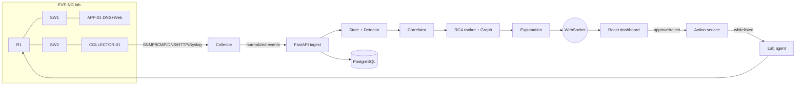
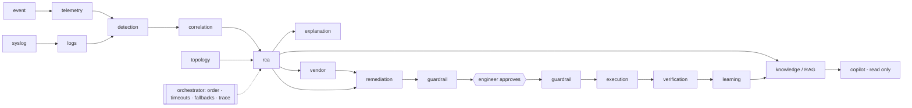

# RootIQ Architecture

Venture X — Infrastructure & Cloud. Local lab + ops console: alert storm → one incident → evidence-backed RCA → approve-only remediation.

## 30-second pitch (every teammate)

Collector on the lab normalizes SNMP/ICMP/DNS/HTTP/Syslog into events → FastAPI state + detector opens one correlated incident → graph RCA ranks candidates with measured evidence → React UI over WebSocket → engineer approve/reject → whitelisted lab agent remediates R1. PostgreSQL persists when Docker is up; sim mode replaces the lab.

## Diagram

## Modes

| Mode | Source of truth | When |
|---|---|---|
| `sim` | In-process Simulator (`ROOTIQ_MODE=sim`) | Default, backup, offline |
| `live` | EVE-NG + COLLECTOR-01 + lab agent | Venue demo when lab healthy |

Badge on the UI always shows the active mode.

## Key packages

| Layer | Path | Role |
|---|---|---|
| Ingest | `backend/app/pipeline`, collectors | Normalize metrics/alerts |
| Detect | `detector` | Baseline / z / static gates |
| Correlate | `intelligence/correlate` | One incident per blast radius |
| Rank | `intelligence/rank` + graph | Top-1 root with components |
| Explain | `intelligence/explain` | Grounded EN/AR (LLM optional, numbers must exist in evidence) |
| Act | `services/action_service` | Reject/approve → whitelist only |
| UI | `frontend/src` | Topology, evidence, timeline, analytics |

## Multi-agent layer (added on branch `my-edits`)

16 specialised agents (14 fully deterministic) run the investigation and stop at a human gate. Two of them (`logs`, `vendor`) make it vendor-aware: see [`VENDORS.md`](VENDORS.md). Full detail: [`AGENTS.md`](AGENTS.md); the big picture and spec compliance: [`BLUEPRINT.md`](BLUEPRINT.md).

Rules: advisors never execute · only a named human can approve (`system`/`agent:*` get 403) · every optional agent has a deterministic fallback · LLM is optional and number-grounded.
