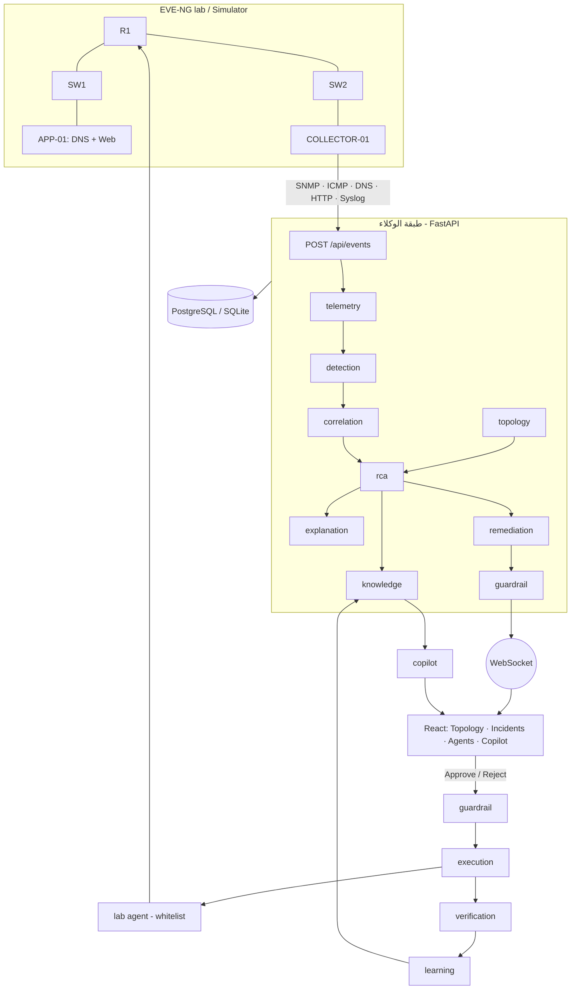

# RootIQ — المخطط الشامل (Blueprint) من الفكرة إلى التشغيل

> يجمع: **وثيقة التنفيذ** (`RootIQ_Platform_Implementation_Specification.docx`) + **العرض** (`RootIQ_Pitch_Deck_Final.pptx`) + **حالة المستودع الفعلية** (v1.0 + طبقة Multi-Agent في هذا الفرع) + **قالب المخطط المعماري** الذي أُرفق (Ingestion → AI Integration → Governance).
> التفاصيل الدقيقة لكل وكيل في [`AGENTS.md`](AGENTS.md). هذا الملف هو الصورة الكبيرة + ما أُنجز + الفجوات + الخطة.

---

## 1. الملخص التنفيذي والصورة الكبيرة

**RootIQ** منصة مراقبة بنية تحتية تحوّل «عاصفة تنبيهات» إلى **حادثة واحدة** بسبب جذري مدعوم بالأدلة وإجراء مقترح **لا يُنفَّذ إلا بموافقة مهندس**، خلال أقل من 60 ثانية (المقاس في المحاكاة: ~12 ث لبلوغ السبب الجذري، الترتيب الأول صحيح 9/9).

الانتقال الذي يطلبه القالب المرفق — «من مجموعة ملفات إلى نظام يعمل بالذكاء الاصطناعي» — يتحقق هنا كالآتي:

| القالب العام | ما يقابله في RootIQ |
|---|---|
| ملفات ومجلدات ثابتة | مستودع منظّم: تطبيق + مختبر + إعدادات + وثائق + اختبارات (§3) |
| **Active AI-Driven Architecture** | خط وكلاء (Agents) ينفّذ التحقيق آليًا ويتوقف عند بوابة الإنسان (`AGENTS.md`) |
| وكيل ذكي مستقل | **16 وكيلًا متخصصًا** بدل وكيل عام؛ 14 منها حتمية بالكامل (منها `vendor` و`logs` لدعم المصنّعين المتعددين) |
| تحكم كامل للمستخدم | Human gate + Guardrail + Audit + مفاتيح تعطيل + وضع Dry run |

### الخريطة العامة

---

## 2. المكدّس التقني (ثلاث طبقات كما في القالب)

### 2.1 طبقة الذكاء والـLLM («العقل»)
| المكوّن | التنفيذ | الملاحظة |
|---|---|---|
| RCA | أوزان حتمية + Graph + Isolation Forest داعم | لا LLM في الترتيب (قابل للتدقيق) |
| LLM | `app/llm/client.py` — مزوّد قابل للتبديل: **Claude / Gemini / Groq** | اختياري؛ لإعادة الصياغة والمساعد فقط |
| ربط API | `LLM_PROVIDER` + مفتاح المزوّد في البيئة | يشمل Google AI Studio (Gemini) وGroq كما في القالب |
| الحماية من الهلوسة | `grounded()`: كل رقم في الجواب يجب أن يوجد في القياسات + شرط الاستشهاد | الفشل ← جواب حتمي |

### 2.2 طبقة البيانات والملفات (السياق وRAG)
| المكوّن | التنفيذ | لماذا |
|---|---|---|
| RAG | `KnowledgeAgent` + `app/rag/index.py` (TF-IDF محلي) | يقرأ الوثائق/الطوبولوجيا/الحوادث ديناميكيًا بدون تضمينها في الكود، ويعمل offline |
| «قاعدة متجهات» | غير لازمة حاليًا (≈ 335 مقطعًا) | الترقية لـpgvector موصوفة في §9 (Supabase = Postgres + pgvector) |
| التخزين | SQLAlchemy: PostgreSQL أو SQLite تلقائيًا + JSON للحوادث/التاريخ | يعمل بدون Docker |
| الخصوصية | حجب الأسرار قبل الفهرسة + لا إرسال خارجي افتراضيًا | §7 |

### 2.3 طبقة الأتمتة والتحكم («العمليات»)
| المكوّن | التنفيذ |
|---|---|
| سكربتات وأتمتة | `scripts/*.sh|ps1`, `lab/scenarios/*`, `backend/scripts/*` (قياس، قبول، تدريبات طوارئ) |
| إجراءات المختبر | وكيل المختبر بقائمة بيضاء ثابتة (`lab/agent/lab_agent.py`) عبر `ExecutionAgent` |
| نشر | Docker Compose · صورة واحدة · `render.yaml` · نفق Cloudflare |
| التحكم بالإصدارات | Git (`v1.0`, `v1.0-rc1`, أوسمة الأيام) — هذا العمل على فرع `my-edits` دون لمس `main` |

---

## 3. دورة التنفيذ المتكاملة (المراحل الثلاث)

### المرحلة 1 — الاستيعاب والهيكلة (File Audit + Context)

| المجلد | التصنيف | يُفهرس في RAG؟ |
|---|---|---|
| `backend/app/{api,collectors,intelligence,services,db,schemas}` | كود التطبيق | لا (الكود ليس مصدر معرفة للمساعد) |
| `backend/app/{agents,rag,llm}` | **جديد**: الوكلاء والمعرفة والـLLM | لا |
| `frontend/src` | واجهة React | لا |
| `configs/topology.json` `layout.json` | إعداد (مصدر حقيقة الطوبولوجيا) | نعم (وصف نصي) |
| `lab/{agent,collector,app01}` | كود المختبر | لا |
| `lab/configs/*` | إعدادات أجهزة | نعم **بعد حجب الأسرار** |
| `lab/scenarios`, `scripts` | سكربتات | لا |
| `docs/*.md`, `README.md`, `RootIQ_Daily_Plan.md` | وثائق | نعم |
| `data/{models,recordings,postmortems,*.json}` | بيانات تشغيل (مستبعدة من Git) | تقارير ما بعد الحادثة: نعم |
| `backend/tests`, `frontend/e2e` | اختبارات | لا |

**سياق الطوبولوجيا** يُبنى من `topology.json` إلى رسم NetworkX (الأجهزة والروابط عقد، الخدمات معلّقة على المضيف، المسار من نقطة `vantage`).

### المرحلة 2 — دمج الذكاء (Use Cases + Pipelines)

| Use case | أين يضيف الذكاء قيمة | الوكيل |
|---|---|---|
| تقليل الضجيج | ربط عشرات الأعراض بحادثة | `correlation` |
| السبب الجذري | ترتيب مفسَّر بالأدلة | `rca` + `topology` |
| الشرح | ملخص عربي/إنجليزي مقيّد بالأرقام | `explanation` |
| الحوادث المشابهة والـrunbook | استرجاع بالمصدر | `knowledge` |
| سؤال وجواب | مساعد للقراءة فقط | `copilot` |
| خطة المعالجة | playbook بتراجع ومعايير نجاح | `remediation` |
| التحقق والتعلّم | إثبات التعافي وتقرير ما بعد الحادثة | `verification` + `learning` |

**خطوط الربط (Pipelines):** `Pipeline.ingest` ← وكلاء الرصد ← `IncidentService` ← `Orchestrator.investigate` ← `ActionService.recommend`؛ وفي المسار الآخر `approve/reject` ← `guardrail` ← `execution` ← `recovery_tick` ← `verification` ← `learning`.

### المرحلة 3 — التحكم والحوكمة (Monitoring + Guardrails)

| الهدف | الآلية |
|---|---|
| مراقبة استهلاك الـAPI/الرموز | `GET /api/agents` ← `health.llm.usage` (calls, errors, avgMs, approxTokens) |
| سجلات التنفيذ | Audit Log + Trace الوكلاء (`/api/agents/trace`) + تقرير ما بعد الحادثة |
| تعليمات صارمة وطبقات تحقق | `guardrail` (10 سياسات) + `grounded()` + القائمة البيضاء + قائمة playbooks الوحيدة |
| إيقاف طارئ | تعطيل الوكلاء الاختياريين، `ROOTIQ_EXECUTION_ENABLED=0` (Dry run)، وضع `sim` |

---

## 4. ماذا يحدث خلف الكواليس (خطوة بخطوة، بأسماء الدوال)

1. **الاستلام:** الـcollector (SNMP/ICMP/DNS/HTTP) أو `Simulator` يرسل `Event` مطبَّعًا إلى `POST /api/events` ← `Pipeline.ingest`.
2. **التحقق:** `TelemetryAgent.observe` يفحص القيمة/الوحدة/التكرار ويحدّث الحداثة (NaN ← 422).
3. **الحالة والكشف:** `StateStore.update` ثم `DetectionAgent.observe` ← `Detector.observe` (عتبة ثابتة ثم z-score) ← `Anomaly`.
4. **الربط:** `IncidentService.on_anomaly` ← `CorrelationAgent.pick` (علاقة طوبولوجية + نافذة 120 ث) ← حادثة جديدة أو دمج.
5. **التأجيل الذكي:** `_schedule_analyze` ينتظر هدوء 3 ث أو سقف 10 ث لتجميع الأعراض.
6. **التحقيق:** `Orchestrator.investigate`: سياق القياسات ← ملخص العاصفة ← نطاق الاعتماديات ← **RCA** ← أثر الطوبولوجيا ← دليل multivariate ← الشرح ← المعرفة (كل خطوة بمهلة وبديل).
7. **التخطيط والفحص:** `ActionService.recommend` ← `RemediationAgent.plan` ← `GuardrailAgent.check('recommend')` ← إجراء `pending` ← `handoff_to_human`.
8. **البث:** `hub.broadcast('incident'|'agent_step')` عبر WebSocket إلى React (الخريطة تظلّل السبب والتأثر).
9. **القرار البشري:** `POST /actions/{id}/reject|approve` ← `guardrail.check('approve')` (اسم بشري، pending، قائمة بيضاء، حد المعدل، عزل المختبر…).
10. **التنفيذ:** `ExecutionAgent.execute` (محاكي أو وكيل المختبر المحصور، أو Dry run).
11. **الإغلاق:** بعد 15 ث: `VerificationAgent.verify` ← `LearningAgent.close_out` (History + Postmortem + فهرسة) ← `orchestrator.incident_closed`.

### كيف يعمل الـRAG (مقابل «Embeddings → Retrieval → Generation» في القالب)
1. **الفهرسة:** المصادر تُقطَّع بحسب عناوين Markdown (≤ 900 حرف)، تُنقّى وتُحجب أسرارها، ثم `TfidfVectorizer` (كلمات + ثنائيات، تطبيع عربي، كلمات وقف EN/AR) يبني مصفوفة المتجهات في الذاكرة.
2. **الاسترجاع:** السؤال يتحول لمتجه بنفس المحوّل؛ التشابه = جيب التمام؛ تُعاد المقاطع فوق العتبة مع المصدر والدرجة (الحوادث/الوثائق/الـplaybooks…).
3. **التوليد:** جواب حتمي مبني على حقائق حية + مقاطع مسترجعة؛ وإن فُعّل LLM يعيد الصياغة تحت شروط التأسيس والاستشهاد.
4. **التغذية الراجعة:** كل حادثة تُغلق تُفهرس (تقرير + ملخص) فتصبح متاحة للاسترجاع لاحقًا.

---

## 5. مصفوفة المطابقة مع وثيقة التنفيذ

الرموز: ✅ مُنجز في v1.0 · ➕ أُضيف في هذا الفرع · ⚠️ جزئي/بحاجة تحقق · ❌ مفتوح

| قسم الوثيقة | الحالة | التفاصيل والملفات |
|---|---|---|
| §1-3 الفكرة والمشكلة والمستخدمون | ✅ | `README.md`, العرض |
| §4 سيناريو الديمو (Inject → RCA → Approve/Reject → Recovery) | ✅ sim · ⚠️ live | ٩ تشغيلات sim مقاسة (`docs/RESULTS.md`). **الوضع الحي على EVE-NG لم أتحقق منه في هذه الجلسة** |
| §5 المعمارية (مصادر ← جمع ← تطبيع ← تخزين ← ذكاء ← واجهة) | ✅ | `docs/ARCHITECTURE.md` |
| §6 مختبر EVE-NG | ✅ ملفات · ⚠️ تشغيل | `lab/configs`, `lab/eve/README.md`. العناوين في `configs/topology.json` (نجمة حول R1 بقرار مجمّد؛ أمثلة الوثيقة توضيحية) |
| §7 الخريطة والمنافذ والألوان | ✅ | React Flow + `PortEdge/DeviceNode`، الـlayout محفوظ (`PUT /api/topology/layout`) |
| §8 القياسات | ✅ SNMP · ICMP · DNS · HTTP · وكيل المضيف (psutil) في `lab/collector` — ⚠️ **Syslog**: المستمع مكتوب لكنه غير موصول بالـcollector (انظر الفروقات ٤) | ➕ `POST /api/topology/reconcile` للتحقق من CDP/LLDP؛ ⚠️ الـcollector لا يجمع CDP/LLDP بعد |
| §9 الخدمات (Topology/Telemetry/Incident/RCA/Recommendation/Realtime) | ✅ | ➕ `POST /api/incidents/{id}/acknowledge` (كانت في §9 ولم تكن موجودة) |
| §10 نموذج البيانات | ⚠️ | جداول `incidents/incident_evidence/actions/audit_log/runs` موجودة؛ **جداول `devices/interfaces/links/metrics` غير موجودة** (الحالة في الذاكرة + `topology.json`). ← §9 خطة |
| §11 الذكاء (baseline + IF + graph + RCA + شرح) | ✅ | الأوزان مطابقة (0.30/0.25/0.20/0.15/0.10) |
| §12 الواجهة (شريط جانبي، خريطة، لوحة حادثة، مؤشرات، Timeline) | ✅ | ➕ صفحة **Agents** (الوكلاء، التتبع الحي، Copilot) + خطة المعالجة وعرض التحقق والحوادث المشابهة في لوحة الحادثة |
| §13 السيناريوهات الثلاثة | ✅ | `lab/scenarios`, `Simulator` |
| §14 الـAPI | ✅ | + إضافات `AGENTS.md §6` |
| §15 الأمان والضوابط | ✅ + ➕ | ➕ `guardrail` (إنسان فقط، حد معدل، عزل المختبر) وـ`ROOTIQ_EXECUTION_ENABLED` ← **«تمكين المقدّم من تعطيل التنفيذ»** كان مطلوبًا في الوثيقة ولم يكن موجودًا. ⚠️ انظر §7 (بيانات اعتماد مختبر داخل المستودع) |
| §16-17 الخطة وتوزيع الفريق | ✅ | `RootIQ_Daily_Plan.md`؛ ➕ خريطة ملكية الوكلاء §8 |
| §18 معايير القبول | ✅ sim · ⚠️ live×3 | الاختبارات: 140 اختبار backend + Vitest + Playwright (`frontend/e2e`) |
| §19 المخاطر | ✅ | وضع sim كاحتياط، `docs/RISKS.md` |

### فروقات مهمة بين الادعاء والواقع (للأمانة)
1. **QoS الحقيقي:** خطة الأيام تعد بتطبيق `service-policy UPLINK-QOS` عبر Netmiko، لكن وكيل المختبر الحالي (`lab_agent.py`) ينفّذ لسيناريو الازدحام **إيقاف مولّد iperf3** فقط. لذلك كتبنا في كل playbook حقل `labImplementation` يوضح المنفَّذ فعلًا. التطبيق الحقيقي = بند في §9.
2. **الدقة المقاسة (9/9 و12 ث)** من **المحاكاة**، وليست من المختبر الحي بعد (كما يذكر `RESULTS.md`).
3. **طبقة الـLLM** جُرّبت بمفتاح **Groq** حقيقي (تفسير + Copilot، بلا أخطاء)، أما Gemini وClaude فبمحاكاة الطلب فقط.
4. **الـCollector لا يشغّل مستمع Syslog:** `lab/collector/syslog_listener.py` موجود لكن `collector.py` لا يستورده ولا يبدأه، فمصدر Syslog المطلوب في المواصفة (§8) غير موصول في الوضع الحي. (التحويل من رسائل Syslog إلى أحداث مكتوب، ينقصه التشغيل.)
5. **`lab/app01/setup.sh` ينكسر:** ينسخ `named.conf.local` وهو غير موجود في `lab/app01/` (خطة الأيام تقول إنه يجب نسخه من ملاحظات البناء)، والسكربت بـ`set -e` فيتوقف عند أول سطر نسخ.
6. **إعداد الوكيل المحصور غير مكتوب في سكربت:** صلاحيات `sudoers` ومفتاح SSH بين COLLECTOR-01 وAPP-01 موجودة في نص خطة الأيام (`RootIQ_Daily_Plan.md` سطر ~1921) لا في ملف قابل للتشغيل.
7. **Docker لم يُجرَّب:** خدمة Docker Desktop كانت متوقفة على الجهاز، فلم أبنِ الصور بعد إضافة `COPY docs` و`COPY lab/configs`.

---

## 6. الإعدادات والنشر

| الحالة | الأمر |
|---|---|
| **أسرع طريقة (ويندوز)** | `powershell -ExecutionPolicy Bypass -File .\scripts\run-demo.ps1` ثم صفحة `/agents` تُفتح تلقائيًا؛ مع LLM: `$env:GROQ_API_KEY='...'` ثم `-Llm groq`؛ الإيقاف: `-Stop` |
| محاكاة محلية (يدوي) | `ROOTIQ_MODE=sim` ثم uvicorn + `npm run dev` (انظر `README.md`) |
| Docker | `docker compose up -d --build` (الصور تنسخ الآن `docs/` و`lab/configs` لصالح الـRAG) |
| نشر عام | `render.yaml` (صورة واحدة) |
| المتغيرات | `.env.example` (الجدول الكامل في `AGENTS.md §7`) |

ملاحظات بيئة اكتُشفت أثناء العمل:
- **مسارات ويندوز الطويلة:** فعّل `git config core.longpaths true` (أو انسخ المشروع لمسار قصير).
- **SQLAlchemy 2.1:** حزمته المُترجمة قد يحجبها **Windows App Control** على بعض الأجهزة (`DLL load failed ... Application Control policy`). ثُبّت الآن `sqlalchemy>=2.0,<2.1` في `requirements.txt`.

---

## 7. مراجعة الأمان والخصوصية

| التهديد | الضابط |
|---|---|
| **Prompt injection** عبر وثيقة/حادثة مسترجَعة | المقاطع = بيانات؛ كاشف أنماط (EN/AR) يستبعد المشبوه من السياق ويحذّر؛ الـCopilot بلا أدوات كتابة أصلًا |
| **تسريب أسرار** إلى الفهرس/LLM | حجب صارم لإعدادات الأجهزة + حجب مرن لقيم `KEY=…`/`-c community` + حجب حرفي لكل سر متعلَّم من الإعدادات + أنماط مفاتيح (sk-, AIza, gsk_) |
| **استقلال زائد للوكلاء** | Human gate + `human_decider` + `requires_human` + `whitelist` + Fail closed |
| **الخروج من المختبر** | `lab_scope` يرفض عنوانًا عامًا؛ الوكيل المحصور لا shell |
| **حلقات تنفيذ** | `rate_limit` (5/5 دقائق) + `action_pending` (لا موافقة مزدوجة) |
| **هلوسة LLM** | `grounded()` + استشهاد إجباري + بديل حتمي |
| **خروج البيانات للمزوّد** | معطّل افتراضيًا؛ عند التفعيل يُرسل فقط: حقائق مقاسة + السؤال + مقاطع محجوبة الأسرار |

⚠️ **مكتشَف في المستودع الحالي (خارج نطاق التعديل، يُنصح بمعالجته):** كلمة مرور المختبر (`secret …` في `lab/configs/r1.cfg` وفي `RootIQ_Daily_Plan.md`) و`SNMP community` مكتوبتان صراحة. هي لمختبر معزول لكنها في مستودع عام على GitHub؛ الأفضل تدويرها ونقلها لمتغيرات بيئة. الـRAG يحجبها تلقائيًا مهما بقيت في الملفات.

---

## 8. ملكية الوكلاء على الفريق

| المحور (من `RootIQ_Daily_Plan`) | الوكلاء | ما يُراجَع |
|---|---|---|
| 🟥 INFRA (المختبر) | `execution` (ما يستدعيه)، `telemetry` (مصادر القياس)، `verification` (معايير النجاح) | الأوامر الثابتة في `lab_agent.py`، واقعية معايير التحقق، إضافة CDP/LLDP |
| 🟨 AI | `detection`, `rca`, `explanation`, `knowledge`, `copilot`, `learning` | الأوزان، العتبات، جودة الاسترجاع، صياغة التقارير |
| 🟩 BE | `orchestrator`, `guardrail`, `correlation`, `topology`, `remediation` | السياسات، المهل، الـAPI، الاستمرارية |
| 🟦 FE | صفحة Agents، Copilot، عرض الخطة/التحقق | تجربة العرض، RTL، الوصول (a11y) |
| ⬜ الجميع | الاختبارات، الديمو | `test_agents.py::test_every_agent_is_documented` يحمي التوثيق |

---

## 9. خارطة الطريق

### Now (جاهز للاستخدام)
16 وكيلًا، RAG محلي، Copilot ثنائي اللغة، Guardrail، تحقق وتقارير، مزوّدو LLM اختياريون، **قاعدة معرفة 43 مصنّعًا** (هوية الجهاز، أوامر الفحص، Syslog، 25 نمط مشكلة) وبيانات تدريب مولَّدة منها (`training/`).

### Next (بعد نجاح الديمو)
| البند | لماذا وكيف |
|---|---|
| **QoS حقيقي عبر Netmiko** | endpoint جديد في وكيل المختبر بقائمة بيضاء (`apply_uplink_qos` / `rollback_uplink_qos`)، يُستدعى من `ExecutionAgent`، واختباره على EVE-NG ×3 |
| **Embeddings/pgvector** | استبدال `KnowledgeIndex._build/search` بتضمينات (Gemini/محلي) وجدول pgvector (Supabase أو Postgres)؛ الواجهة `search()` ثابتة |
| **تخزين القياسات** | جداول `metrics/links/devices` (TimescaleDB أو Postgres مقسّم) لتغذية RCA بالتاريخ الحقيقي |
| **CDP/LLDP** | إضافة جمعها في `collector.py` وإرسالها إلى `/api/topology/reconcile` (الوكيل جاهز) |
| **هوية وصلاحيات (RBAC)** | ربط `decidedBy` بمستخدم مصادَق بدل نص حر؛ حاليًا `human_decider` يمنع الأسماء الآلية فقط |
| **تراجع مقترح عند `unverified`** | اليوم يُسجَّل ويظهر في التقرير؛ لاحقًا يُقترح تنفيذ `rollback` بموافقة المهندس |
| **فصل الوكلاء** | كل وكيل خدمة مستقلة عند الحاجة (الواجهات صريحة) |

### Later
تعلّم الأوزان من الحوادث المغلقة، تحليل أثر التغيير، تكامل ITSM (ServiceNow/Jira)، نشر خاص للعملاء.

---

## 10. «لقطة الوكلاء» للديمو (دقيقتان تُضاف لسيناريو الخمس دقائق)

1. بعد ظهور الحادثة افتح **Agents ← Live trace**: «كل خطوة وكيل مختلف، مع الزمن والقرار».
2. **Overview**: أشِر لبوابة الإنسان الخضراء: «قبلها تحليل وبعدها لا يعمل شيء بدون مهندس».
3. **Copilot** (بالعربية): «لماذا ليس DNS هو السبب؟» ← جواب مفسَّر مع المصدر.
4. اطلب منه «وافق على الإجراء» ← يرفض لأنه للقراءة فقط.
5. (اختياري) أرسل `approve` بـ`decidedBy=system` من الطرفية ← **403** وسجل `guardrail_denied`.
6. وافق كمهندس ← شاهد `execution` ثم `verification` (3/3) ثم `learning` وتقرير ما بعد الحادثة.

**أسئلة الحكم المتوقعة:** انظر إضافات `QA_BANK.md` (Multi-Agent).

---

## 11. تعريف الإنجاز
- [x] 16 وكيلًا بأدوار موثّقة ومختبرة (أكثر من 230 اختبارًا backend).
- [x] قاعدة معرفة المصنّعين (43 مصنّعًا، 59 نظام تشغيل، 103 عائلة أجهزة، 25 مشكلة) مربوطة بالوكلاء ومُتحقَّق منها آليًا (`validate()`) — انظر `VENDORS.md` لحدودها الصريحة.
- [x] مجلد `training/`: بيانات تدريب مولَّدة وحتمية (≈4.7 ألف مثال EN/AR) + مقيّم آلي + كتالوج Hugging Face + دفتر Colab.
- [x] الوكلاء لا ينفّذون بدون موافقة إنسان (اختبارات رفض + fail-closed).
- [x] كل وكيل اختياري له بديل حتمي وتم اختبار التعطيل والمهلة.
- [x] الواجهة: Agents + Trace + Copilot + خطة المعالجة + التحقق.
- [x] Playwright ×3 (حلقة الديمو الكاملة: حقن ← سبب جذري ← رفض ← موافقة ← تعافٍ) نجحت في متصفح حقيقي (Edge) والـLLM مفعّل.
- [x] الوضع الحي جُرّب **بعقد وكيل المختبر الحقيقي** (`lab_agent.py` بأوامره الخارجية مستبدلة بمسجِّلات) وcollector مزيف: الرفض لا يستدعي المختبر، والموافقة تستدعي `remediate` مرة واحدة، والتحقق 3/3، ومع `ROOTIQ_EXECUTION_ENABLED=0` تصير الموافقة Dry run بلا أي استدعاء.
- [x] تجربة LLM بمفتاح Groq حقيقي وقياس `usage` (انظر `AGENTS.md §5`).
- [ ] تشغيل الوضع الحي على **EVE-NG الحقيقي** ×3 (يحتاج المختبر).
- [ ] بناء صور Docker وتجربتها (تحتاج تشغيل Docker Desktop).
