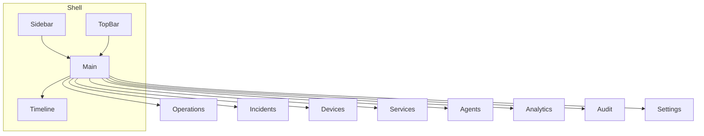

# واجهات RootIQ — دليل الشاشات

> دليل للمستخدم/العارض: **ماذا ترى في كل صفحة** وما وظيفة كل جزء.  
> للكود الخلفي والوكلاء الـ16 انظر [`AGENTS.md`](AGENTS.md). للعقود والأحداث انظر [`CONTRACTS.md`](CONTRACTS.md).

الكود: `frontend/src/` · المسارات في `frontend/src/App.tsx` · الإطار في `frontend/src/components/layout/Shell.tsx`

---

## 0. خريطة سريعة

| المسار | الصفحة | الحالة |
|---|---|---|
| `/` | Operations (العمليات / الطوبولوجيا) | كاملة — شاشة الديمو الرئيسية |
| `/incidents` · `/incidents/:id` | Incidents (الحوادث) | كاملة |
| `/devices` | Devices (الأجهزة) | كاملة |
| `/services` | Services (الخدمات) | Placeholder — Coming soon |
| `/agents` | Agents (الوكلاء) | كاملة — Overview / Trace / Copilot |
| `/analytics` | Analytics (التحليلات) | كاملة |
| `/audit` | Audit (سجل التدقيق) | كاملة |
| `/settings` | Settings (الإعدادات) | كاملة |

---

## 1. الإطار المشترك (Shell)

كل الصفحات تعمل داخل نفس الهيكل:

| المنطقة | الموقع | ماذا تفعل |
|---|---|---|
| **Sidebar** | يسار (أو يمين في RTL) | تنقّل بين الصفحات الثماني + شعار `RQ` |
| **TopBar** | أعلى المحتوى | اسم التطبيق، الوضع، حالة الاتصال، اللغة |
| **Main** | الوسط | محتوى الصفحة الحالية |
| **Timeline** | أسفل | آخر ~5 دقائق لمسار الحادثة |

عند انقطاع WebSocket يظهر شريط أحمر أعلى المحتوى: **Reconnecting…**. عنوان تبويب المتصفح يصير `● N incident — RootIQ` عند وجود حادثة مفتوحة.

### 1.1 الشريط الجانبي (Sidebar)

أيقونات فقط (tooltip عند التمرير):

| أيقونة | الوجهة | المعنى |
|---|---|---|
| شبكة | `/` | Operations |
| صفارة | `/incidents` | Incidents |
| خادم | `/devices` | Devices |
| صناديق | `/services` | Services |
| روبوت | `/agents` | Agents |
| رسم بياني | `/analytics` | Analytics |
| درع | `/audit` | Audit |
| ترس | `/settings` | Settings |

في وضع Presenter يُخفى الشريط (`presenter-hide`).

### 1.2 الشريط العلوي (TopBar)

- **RootIQ** + تسمية Operations
- **شارة الوضع:** `SIMULATION` أو `LIVE LAB` — النقر يبدّل الوضع فورًا (`POST /api/demo/mode`)
- **نقطة WebSocket:** `open` / `connecting` / `closed`
- **Last update Xs ago** — عمر آخر لقطة من الـfeed
- زر **ع / EN** — تبديل اللغة (واجهة + شرح الحادثة إن وُجد عربي)

### 1.3 الخط الزمني (Timeline)

أسفل الشاشة دائمًا. يعرض علامات زمنية نسبية للحادثة النشطة (أو آخر ديمو):

| الرمز | الحدث |
|---|---|
| ▲ | Injected |
| ● | First anomaly / Incident opened |
| ◆ | Root cause |
| ✕ | Rejected |
| ✓ | Approved |
| ⚙ | Executed |
| ★ | Recovered |

---

## 2. اختصارات لوحة المفاتيح

تعمل عالميًا (ما لم يكن المؤشر داخل حقل إدخال). كلها مع **Shift**:

| الاختصار | الفعل |
|---|---|
| `Shift+1` | حقن سيناريو ازدحام الرابط (Uplink Congestion) |
| `Shift+2` | حقن فشل DNS |
| `Shift+3` | حقن ارتفاع حمل الخادم (Server Spike) |
| `Shift+R` | إعادة ضبط الديمو |
| `Shift+P` | تفعيل/إلغاء **Presenter Mode** (إخفاء السايدبار، تكبير العرض، إخفاء المؤشر بعد خمول 3 ث) |

---

## 3. صفحة Operations — `/`

شاشة الديمو الرئيسية. الخلفية = خريطة الطوبولوجيا الحية؛ فوقها لوحات عائمة.

### 3.1 خريطة الطوبولوجيا (TopologyCanvas)

- أجهزة (router / switch / server / collector) وروابط بينها
- أثناء الحادثة: تظليل **سبب جذري** مقابل **مسار تأثر**
- النقر على جهاز/رابط (بدون حادثة نشطة) يفتح المفتّش الجانبي
- يمكن سحب العقد وحفظ التخطيط عبر الـAPI

### 3.2 Alert Storm (أعلى يسار)

مقارنة بصرية:

- **Traditional NMS:** عدد التنبيهات الخام (مثل 74 alerts)
- **RootIQ:** حادثة واحدة + تسمية السبب
- **Noise reduction %** وقائمة أحدث الأعراض المتدفقة

بدون حادثة: تدفق تنبيهات خام أو رسالة هادئة.

### 3.3 MTTD Stopwatch (أعلى وسط)

ساعة من لحظة الحقن حتى ظهور السبب الجذري. الهدف **&lt; 60 ثانية**. تتجمّد عند اكتمال التحليل وتلوّن أخضر/أصفر حسب الهدف.

### 3.4 Services Panel (أسفل، يسار لوحة الحادثة)

حالة الخدمات الحية (مثل Internal DNS و Web Application) مع مقاييس latency / success. إن كان الويب متأثرًا عبر DNS تظهر عبارة dependency.

### 3.5 Demo Controls (أسفل يسار)

| زر | اختصار |
|---|---|
| Inject Uplink Congestion | ⇧1 |
| Inject DNS Failure | ⇧2 |
| Inject Server Spike | ⇧3 |
| Reset Demo | ⇧R |

حالة الديمو تظهر أعلى اللوحة (`idle` / `injected` / …). الأزرار تُعطَّل أثناء تشغيل سيناريو.

### 3.6 شارة «كل شيء سليم»

عند عدم وجود حادثة مفتوحة (وليس بعد التعافي مباشرة): شارة خضراء في الأعلى تفيد أن لا حادثة نشطة.

### 3.7 Device Inspector / Link Inspector

تظهر عند اختيار عقدة أو رابط **فقط إذا لم تكن هناك حادثة نشطة** (لوحة الحادثة لها الأولوية). تعرض هوية الجهاز، المنافذ، المقاييس، أو طرفي الرابط وحالته.

### 3.8 Incident Panel

لوحة يمين ثابتة (~420px) — انظر **§8**.

---

## 4. صفحة Incidents — `/incidents`

قائمة كل الحوادث من الـstore الحي.

- **فلاتر الحالة:** all · open · investigating · recommendation_ready · awaiting_approval · approved · resolved
- **جدول:** ID، العنوان، الحالة، الشدة، وقت الفتح، السبب الجذري، الثقة
- النقر على صف يفتح نفس **Incident Panel** جانبيًا؛ الرابط `/incidents/:id` يحدّد الحادثة من المسار

---

## 5. صفحة Devices — `/devices`

جدول أجهزة الطوبولوجيا مع بحث (اسم، IP، نوع، معرّف).

| عمود | المحتوى |
|---|---|
| Name | التسمية |
| Type | router / switch / server / … |
| IP | management IP |
| Status | بلون الحالة |
| CPU | نسبة إن وُجدت |
| Ports | عدد الواجهات |

أسفل الجدول: `N / total devices`.

---

## 6. صفحة Services — `/services`

**غير مكتملة:** تعرض فقط `Services — Coming soon`. مراقبة الخدمات الحية موجودة حاليًا داخل Operations (Services Panel) ولوحة الحادثة (Affected services).

---

## 7. صفحة Agents — `/agents`

واجهة طبقة الوكلاء المتعددة. تُحدَّث القائمة كل ~4 ثوانٍ.

### رأس الصفحة

- العنوان وعدد الوكلاء (16)
- شارات صحة:
  - LLM on/off (+ المزوّد والنموذج إن فُعّل)
  - عدد مقاطع قاعدة المعرفة (KB)
  - عدد المصنّعين / تغطية full إن وُجدت
  - جودة بيانات القياسات %

### تبويب Overview

1. **Flow diagram** — مراحل التدفق (رصد → ربط → تشخيص → تخطيط → إنسان → تنفيذ → إغلاق) مع إمكانية اختيار وكيل والتمرير لبطاقته
2. **بطاقات الوكلاء (16)** — لكل وكيل:
   - الاسم (EN/AR حسب اللغة)، الطبقة، مستوى الاستقلالية
   - مفتاح تفعيل/تعطيل (للوكلاء القابلة للتعطيل فقط؛ الأساسية مقفلة)
   - الفائدة، الإحصائيات (runs / errors / avgMs)
   - تفاصيل قابلة للطي: inputs / outputs / tools / needs / guardrails

### تبويب Trace

- فلتر حسب الحادثة (أو الكل)
- **Live Trace:** خطوات `agent · action · status · المدة · الملخص` كما بُثّت عبر WebSocket / `GET /api/agents/trace`

### تبويب Copilot

- لوحة محادثة للقراءة فقط (لا توافق ولا تنفّذ)
- اقتراحات جاهزة (مثل: What happened? · Why not DNS? · What should I do?)
- جانب أيمن: سياق الحادثة النشطة + شرح مختصر لآلية العمل (حقائق + مصادر؛ LLM اختياري ومؤسَّس)

تفاصيل سلوك كل وكيل: [`AGENTS.md`](AGENTS.md).

---

## 8. لوحة الحادثة (Incident Panel)

مشتركة بين **Operations** و **Incidents**. تظهر عند وجود حادثة نشطة (أو آخر resolved بعد التعافي في الديمو).

### 8.1 الرأس وشريط المراحل

- `INC-####` · الحالة · الشدة (high/critical…) · مؤقت منذ الفتح `MM:SS`
- شريط مراحل:  
  `OPEN → INVESTIGATING → RECOMMENDATION READY → AWAITING APPROVAL → APPROVED → RESOLVED`

### 8.2 السبب الجذري

- حلقة ثقة (Confidence ring) بالنسبة المئوية
- التصنيف: Network / DNS / Server حسب نوع الكيان
- التسمية + `entityId`
- تحذير إن كانت الثقة منخفضة وتحتاج تحقيقًا إضافيًا

### 8.3 Why this cause?

ترتيب أفضل المرشحين مع الدرجات ومكوّنات الدرجة (metric anomaly، dependency overlap، …) وذكر إن كان العرض **downstream** من السبب الحقيقي.

### 8.4 Explanation

نص إنجليزي أو عربي حسب لغة الواجهة. المصدر يظهر صراحة:

- `template` — قالب حتمي (الافتراضي بدون LLM)
- `LLM · grounded ✓` — إعادة صياغة بشرط أن كل رقم موجود في الحقائق

### 8.5 Replay

تشغيل سريع لمسار الأدلة/الخطوات (مثل Replay 5×).

### 8.6 Evidence

قائمة أعراض مرتبة زمنيًا: الكيان · المقياس · القيمة مقابل الـbaseline · الإزاحة بالثواني من أول شذوذ.

### 8.7 Affected services

الخدمات المتأثرة المرتبطة بالحادثة.

### 8.8 Recommended action (Action Card)

- وصف الإجراء المقترح + مستوى المخاطرة
- بدائل نصية (إن وُجدت)
- **Plan** قابل للطي: معرّف الـplaybook، خطوات (read / change / verify)، rollback، معايير النجاح، وتحذيرات Guardrail
- **Vendor diagnostics / Applying a change** — أوامر قراءة وإصلاح مرجعية حسب مصنّع الجهاز (لا تُنفَّذ تلقائيًا)
- أزرار:
  - **Approve Remediation** — باسم المهندس من Settings
  - **Reject** — مع سبب
  - رسالة: لا تغيير بدون موافقة مهندس
- بعد الحل: بطاقة Recovered ★

الموافقة من `system` أو `agent:*` مرفوضة من الخادم (403) — انظر Guardrail في [`AGENTS.md`](AGENTS.md).

### 8.9 Recovery verification

بعد التنفيذ: حالة `verified / partial / unverified` وعدد الفحوص الرقمية (مثل utilization &lt; 70).

### 8.10 Similar past incidents

إن وجد وكيل المعرفة حوادث/تقارير مشابهة تظهر هنا.

### 8.11 Acknowledge + Noise reduction

- زر **Acknowledge** (أو اسم من أقرّ)
- شارة تقليل الضجيج: `(N alerts → 1 incident)` ونسبة التقريب

---

## 9. صفحة Analytics — `/analytics`

تُحدَّث من `GET /api/runs` كل ~5 ثوانٍ.

### بطاقات الملخص

| البطاقة | المعنى |
|---|---|
| Top-1 accuracy | كم مرة كان السبب الأول صحيحًا / عدد التشغيلات |
| Avg time to root cause | متوسط الثواني حتى السبب |
| Avg noise reduction | متوسط تقليل التنبيهات |
| Runs | عدد التشغيلات المسجّلة |

### الرسم

أعمدة زمن الوصول للسبب لكل run، مع خط مرجعي أصفر عند **60s** (الهدف).

### الجدول

# · Scenario · Mode · TTR · Noise · Correct (✓/✗)

بدون تشغيلات: رسالة «No runs yet — complete a demo loop first.»

---

## 10. صفحة Audit — `/audit`

سجل تدقيق من `GET /api/audit` (تحديث دوري):

| عمود | مثال |
|---|---|
| Time | وقت الإدخال |
| Actor | اسم المهندس |
| Action | approve / reject / toggle / guardrail_denied / … |
| Target | ACT-… / agent id / … |
| Detail | JSON مختصر |

يثبت أن التنفيذ والموافقات مرتبطة بإنسان حقيقي.

---

## 11. صفحة Settings — `/settings`

1. **Engineer name** — يُحفظ في `localStorage` كمفتاح `rootiq.engineer` ويُستخدم في Approve / Reject / Acknowledge / Toggle agent
2. **Demo failover** — التحويل بين Simulation و Live lab مع رسالة تأكيد (نفس فكرة شارة TopBar عند تعثّر المختبر الحي)

---

## 12. تدفق استخدام نموذجي (ديمو)

1. افتح `/` وتأكد أن الشارة **SIMULATION** والاتصال `open`
2. `Shift+P` إن كنت تعرض للجمهور
3. `Shift+1` (أو زر Demo Controls) → راقب Alert Storm + MTTD + ظهور INC في اللوحة اليمنى
4. اقرأ السبب، الأدلة، الخطة، وأوامر المصنّع إن ظهرت
5. (اختياري) `/agents` → Trace لرؤية خطوات الوكلاء؛ أو Copilot لسؤال «Why not DNS?»
6. **Approve** من اللوحة (باسم مهندس من Settings) → راقب التنفيذ والتحقق والتعافي
7. `/analytics` و `/audit` لمراجعة الأرقام والسجل
8. `Shift+R` لإعادة الديمو

---

## 13. ملاحظات صادقة

- صفحة **Services** ما زالت placeholder؛ الخدمات تُعرض في Operations ولوحة الحادثة.
- **LLM** معطّل افتراضيًا (`LLM_ENABLED=0`)؛ الشرح من القوالب والـCopilot حتمي. تفعيله اختياري ولا يغيّر أرقام RCA.
- وكيل `logs` لا يظهر أثره في الواجهة إلا بعد إدخال syslog عبر الـAPI؛ و`execution` / `verification` / `learning` تظهر في الـTrace بعد الموافقة.
- الواجهة تعتمد على WebSocket للقطات الحية؛ بدون باكند على المنفذ 8000 تبقى الشاشة في «Connecting…» أو Reconnecting.

---

## 14. أين الكود؟

| الجزء | المسار |
|---|---|
| التوجيه | `frontend/src/App.tsx` |
| الإطار | `frontend/src/components/layout/` |
| Operations | `frontend/src/pages/OperationsPage.tsx` |
| لوحة الحادثة | `frontend/src/components/incidents/` |
| الديمو العائم | `frontend/src/components/demo/` |
| الطوبولوجيا | `frontend/src/components/topology/` |
| الوكلاء | `frontend/src/pages/AgentsPage.tsx` · `frontend/src/components/agents/` |
| الاختصارات | `frontend/src/hooks/useHotkeys.ts` |
