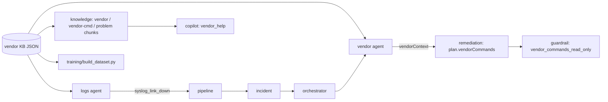

# قاعدة معرفة المصنّعين (Vendor Knowledge Base)

> **الجواب المباشر على السؤال «هل يعرف كل الشركات والسوتشات والإصدارات والمشاكل؟»:** يعرف **43 مصنّعًا**، **59 عائلة نظام تشغيل**، **103 عائلة/سلسلة أجهزة**، و**25 نمط مشكلة**، لكن **بمستويات تغطية معلنة**: 5 مصنّعين بتغطية كاملة، 7 جزئية، و31 «تعريف فقط». **لا يدّعي الشمول**: الموديلات بمستوى السلسلة لا كل SKU، والأوامر وأنماط syslog كُتبت من المعرفة العامة (لم تُلتقط من أجهزة حقيقية) وتحمل علامة ثقة.

الكود: `backend/app/knowledge/` (المحمّل والمتحقق) · البيانات: `backend/app/knowledge/data/` · الوكلاء: `vendor` و`logs` (انظر [`AGENTS.md`](AGENTS.md) §4.15–4.16) · الاختبارات: `test_knowledge_base.py` `test_vendor_agents.py`.

## 1. ماذا في القاعدة

| الملف | المحتوى |
|---|---|
| `data/vendors/<id>.json` | ملف لكل مصنّع: الأسماء المستعارة (EN/AR)، الفئات، أرقام IANA PEN، عائلات أنظمة التشغيل (regex لـ`sysDescr` ولصيغة الإصدار، نوع Netmiko، مثال)، سلاسل الأجهزة (الاسم، الدور، النظام)، جداول الأوامر لكل قدرة، أنماط syslog، روابط النشرات الأمنية، `coverage` و`confidence` |
| `data/problems.json` | 25 نمط مشكلة: الأعراض والكلمات المفتاحية (EN/AR)، الأسباب، **فحوصات** (بأسماء قدرات)، **إصلاحات** (كلها تحتاج موافقة، مع التراجع)، معايير تحقق بمقاييس RootIQ، ونطاق الانطباق (`applies_to`) |
| `data/capabilities.json` | 26 «قدرة» موحّدة (عرض الإصدار، حالة المنافذ، أخطاء CRC، البصريات، VLAN، STP، MAC، الجيران، CPU، الذاكرة، البيئة، OSPF/BGP، LAG، PoE، QoS…) — هي ما يربط المشكلة بأمر كل مصنّع |

الأرقام المولَّدة من الكود: 246 مدخل أمر، 26 نمط syslog لـ9 مصنّعين (Arista Networks، Cisco Systems، Extreme Networks، Fortinet، HPE Aruba Networking، Huawei، Juniper Networks، Linux servers، MikroTik).

## 2. جدول التغطية (مولَّد من القاعدة)

| المعرّف | المصنّع | التغطية | الثقة | أنظمة التشغيل | عائلات الأجهزة | قدرات لها أوامر | أنماط syslog |
|---|---|---|---|---|---|---|---|
| `arista` | Arista Networks | full | high | eos | 6 | 23 | 3 |
| `cisco` | Cisco Systems | full | high | ios-xe, ios, nx-os, ios-xr | 12 | 25 | 12 |
| `hpe-aruba` | HPE Aruba Networking (Aruba + HP ProCurve) | full | medium | aos-cx, arubaos-switch | 7 | 20 | 1 |
| `huawei` | Huawei | full | medium | vrp | 6 | 20 | 2 |
| `juniper` | Juniper Networks | full | high | junos | 9 | 24 | 4 |
| `dell` | Dell Technologies (Dell EMC Networking / PowerSwitch) | partial | medium | os10, dnos6, os9 | 4 | 15 | 0 |
| `extreme` | Extreme Networks | partial | medium | exos, voss | 6 | 18 | 1 |
| `fortinet` | Fortinet | partial | low | fortiswitchos, fortios | 3 | 16 | 1 |
| `h3c` | H3C / HPE FlexNetwork (Comware) | partial | medium | comware | 3 | 0 | 0 |
| `linux` | Linux servers (Ubuntu / Debian / RHEL family) | partial | medium | linux | 0 | 13 | 1 |
| `mikrotik` | MikroTik | partial | medium | routeros, swos | 3 | 22 | 1 |
| `nvidia` | NVIDIA Networking (Mellanox / Cumulus) | partial | medium | cumulus, onyx | 3 | 16 | 0 |
| `adtran` | ADTRAN | profile-only | low | adtran-os | 1 | 0 | 0 |
| `alcatel-lucent-enterprise` | Alcatel-Lucent Enterprise | profile-only | medium | aos | 2 | 0 | 0 |
| `allied-telesis` | Allied Telesis | profile-only | medium | awplus | 3 | 0 | 0 |
| `brocade` | Brocade (legacy; now Extreme / Ruckus / Broadcom) | profile-only | medium | fastiron, nos, netiron | 3 | 0 | 0 |
| `calix` | Calix | profile-only | low | axos | 1 | 0 | 0 |
| `cambium` | Cambium Networks | profile-only | low | cn-os | 1 | 0 | 0 |
| `checkpoint` | Check Point (firewalls) | profile-only | medium | gaia | 1 | 0 | 0 |
| `ciena` | Ciena | profile-only | low | saos | 1 | 0 | 0 |
| `d-link` | D-Link | profile-only | low | dlink-ds | 2 | 0 | 0 |
| `edgecore` | Edgecore (Accton) | profile-only | low | edgecore-os | 1 | 0 | 0 |
| `ericsson` | Ericsson (routing) | profile-only | low | ericsson-os | 1 | 0 | 0 |
| `f5` | F5 (BIG-IP / load balancers) | profile-only | low | tmos | 1 | 0 | 0 |
| `fs` | FS.COM | profile-only | low | fsos | 1 | 0 | 0 |
| `hirschmann` | Hirschmann (Belden) | profile-only | low | hios | 1 | 0 | 0 |
| `lenovo` | Lenovo (RackSwitch / ThinkSystem NE) | profile-only | low | cnos, enos | 2 | 0 | 0 |
| `moxa` | Moxa | profile-only | medium | moxa-os | 2 | 0 | 0 |
| `netgear` | NETGEAR | profile-only | low | prosafe | 2 | 0 | 0 |
| `nokia` | Nokia (incl. ex-Alcatel-Lucent) | profile-only | medium | sr-linux, sr-os | 3 | 0 | 0 |
| `paloalto` | Palo Alto Networks (firewalls) | profile-only | medium | pan-os | 1 | 0 | 0 |
| `peplink` | Peplink | profile-only | low | firmware8 | 1 | 0 | 0 |
| `planet` | PLANET Technology | profile-only | low | planet-os | 0 | 0 | 0 |
| `ruckus` | Ruckus (CommScope) | profile-only | medium | ruckus-fastiron | 1 | 0 | 0 |
| `ruijie` | Ruijie Networks | profile-only | low | rgos | 0 | 0 | 0 |
| `siemens` | Siemens (SCALANCE) | profile-only | medium | scalance | 1 | 0 | 0 |
| `sonic` | SONiC (open-source network OS) | profile-only | low | sonic | 0 | 0 | 0 |
| `supermicro` | Supermicro (SSE switches) | profile-only | low | supermicro-os | 0 | 0 | 0 |
| `teltonika` | Teltonika Networks | profile-only | low | rutos | 1 | 0 | 0 |
| `tp-link` | TP-Link | profile-only | low | jetstream | 2 | 0 | 0 |
| `ubiquiti` | Ubiquiti | profile-only | low | unifi-switch, edgeswitch, edgeos | 2 | 0 | 0 |
| `zte` | ZTE | profile-only | low | zxr10 | 1 | 0 | 0 |
| `zyxel` | Zyxel | profile-only | low | zyxel-os | 2 | 0 | 0 |

معنى التغطية:
* **full** — أوامر فحص لمعظم القدرات + regex للهوية والإصدار (وأنماط syslog لبعضهم فقط: انظر العمود الأخير؛ HPE/Aruba بلا أنماط syslog بعد).
* **partial** — بعض ما سبق (مثلًا H3C: هوية وسلاسل بلا أوامر)؛ راجع وثائق المصنّع قبل الاعتماد.
* **profile-only** — يُعرَّف المصنّع ونظامه وسلاسله (ورقم PEN والاسم) فقط، **بلا أوامر**؛ وكيل `vendor` يقول «لا توجد أوامر مُعدّة» ولا يخترع.

معنى الثقة (`confidence`): مدى الوثوق بما كُتب، وليس بحجمه. **لا شيء هنا مؤكَّد بالتقاط من جهاز حقيقي**؛ الاستثناء الوحيد أرقام IANA PEN التي فُحصت مقابل سجل IANA (التاريخ داخل كل ملف في `pen_verification`).

## 3. كيف يُستخدم (التكامل)

1. **هوية الجهاز:** `POST /api/vendors/identify` أو حقول العقدة في `configs/topology.json` (`vendor` نص حر، و`sysDescr`، و`sysObjectId`، و`os`). الأولوية: `sysObjectId` (رقم المؤسسة) ثم `sysDescr` (regex) ثم التلميح. يُرجع المصنّع والنظام والإصدار (مع توحيده: `17.09.04a` = `17.9.4a`) والموديل ونوع Netmiko و`confidence`.
2. **إثراء الحادثة:** بعد RCA يحدد `vendor` الجهاز/المنفذ (رابط ← طرفاه) ويطابق المقاييس مع الأنماط ويبني `incident.vendorContext`. يظهر في الخطة (`plan.vendorCommands`) وفي لوحة الحادثة («Vendor diagnostics»).
3. **Syslog:** `POST /api/syslog` (رمز الإدخال نفسه). سطر «المنفذ Gi0/0 سقط» بصيغة أي مصنّع مدعوم ← حدث `syslog_link_down` على الرابط ← الـpipeline.
4. **الـCopilot:** «ما أمر فحص أخطاء CRC على Juniper؟» ← جواب حرفي من القاعدة (لا يعاد صياغته بالـLLM) مع «RootIQ لا ينفّذها».
5. **الـRAG:** ملف لكل مصنّع وجدول أوامر لكل نظام وملف لكل مشكلة (بوزن 0.9 كي لا تطغى على وثائق المشروع).
6. **التدريب:** `training/build_dataset.py` يحوّلها إلى بيانات (انظر [`../training/README.md`](../training/README.md)).

## 3b. الأجهزة ذات الأولوية: Cisco وJuniper وFortinet وAruba وArista

ملاحظة من مهندسي الميدان: هذه أغلب المصنّعين غير Cisco، والمعمل الافتراضي (EVE-NG) أجهزته Cisco. **الفرق الحقيقي بينها غالبًا في أمرين:** صيغة كتابة الأوامر، وطريقة حفظ الإعداد (NVRAM / commit). لذلك أضافت القاعدة لكل نظام تشغيل من هذه الخمسة:

* **نموذج الإعداد `config_model`:** هل التغيير يسري فورًا ويحتاج حفظًا (`running-startup`: Cisco وArista وAruba)، أم يمر بإعداد مرشّح ويحتاج `commit` (`candidate-commit`: Junos وIOS-XR)، أم يُطبَّق ويُحفظ تلقائيًا (`auto-save`: FortiOS)؟ مع أوامر الدخول والحفظ ونقطة الاسترجاع والتغيير الآمن والتراجع.
* **أسلوب الأوامر `cli_style`** (EN/AR): أوضاع الـCLI، الاختصارات، الفلاتر، أسماء الواجهات (`Gi0/1` مقابل `ge-0/0/1` مقابل `1/1/1` مقابل `port1`).

| النظام | النمط | الدخول | الحفظ / التفعيل | تغيير أكثر أمانًا | التراجع |
|---|---|---|---|---|---|
| Cisco Systems — Cisco IOS XE | running-startup | `configure terminal` | `copy running-config startup-config` ; `write memory` | `reload in 5` ; `reload cancel` | `configure replace flash:<backup> force` |
| Cisco Systems — Cisco IOS (classic) | running-startup | `configure terminal` | `copy running-config startup-config` ; `write memory` | `reload in 5` ; `reload cancel` | `configure replace flash:<backup> force` |
| Cisco Systems — Cisco NX-OS | running-startup | `configure terminal` | `copy running-config startup-config` | — | `rollback running-config checkpoint <name>` |
| Cisco Systems — Cisco IOS XR | candidate-commit | `configure terminal` | `commit` | `commit confirmed 5` | `rollback configuration last 1` |
| Juniper Networks — Junos OS | candidate-commit | `configure` | `commit` | `commit confirmed 5` | `rollback 1` ; `commit` |
| Fortinet — FortiSwitchOS | auto-save | `config <path>` | — | — | `execute restore config tftp <file> <server>` |
| Fortinet — FortiOS (FortiGate firewalls) | auto-save | `config <path>` | — | — | `execute restore config tftp <file> <server>` |
| HPE Aruba Networking — ArubaOS-CX | running-startup | `configure terminal` | `write memory` ; `copy running-config startup-config` | — | `checkpoint rollback <name>` |
| HPE Aruba Networking — ArubaOS-Switch (ProVision / ProCurve) | running-startup | `configure` | `write memory` | — | — |
| Arista Networks — Arista EOS | running-startup | `configure terminal` | `write memory` ; `copy running-config startup-config` | `configure session <name>` ; `commit timer 00:05:00` | `configure replace flash:<backup>` |

* يظهر هذا في **لوحة الحادثة** («Applying a change») وفي `plan.vendorCommands.devices[].configModel`، ويجيب عنه الـCopilot («كيف أحفظ الإعداد على Juniper وArista؟» — حتى 4 مصنّعين جنبًا إلى جنب).
* **مصنّعو المعمل المختلط:** `configs/topology.multivendor.example.json` مثال جاهز فيه Cisco IOS وJuniper vQFX وArista vEOS وFortiGate-VM وAruba AOS-CX بحقول `sysDescr`/`vendor`؛ انسخه فوق `configs/topology.json` (أو `TOPOLOGY_PATH`) وعدّل الأسماء والمنافذ. صور EVE-NG الشائعة لهذه المصنّعين موجودة عادةً (تحقق من قائمة الصور والتراخيص عندك).
* أسماء الصور الافتراضية معروفة للقاعدة (`vQFX`, `vMX`, `vSRX`, `vEOS`, `cEOS`, `FortiGate-VM`, `AOS-CX`).
* **أضعفها ثقةً: Fortinet** (ثقة `low`): أوامر FortiOS وFortiSwitchOS كُتبت من المعرفة العامة. التقط مخرجات FortiGate-VM (`get system status`، سطور syslog) وأضفها لأمثلة `fortinet.json` لرفع الثقة. وAruba: أنماط syslog لـArubaOS-Switch فقط (صيغة `port X is now off-line`)؛ صيغة AOS-CX غير مضافة بعد.

## 4. الأمان

* أوامر «القراءة» تمر بقائمة سماح لأفعال الفحص (`show`, `display`, `get`, `diagnose`…) وقائمة منع لأفعال التغيير (`reload`, `write`, `set`, `clear`, `shutdown`…) **عند التحقق من البيانات وعند حكم الـGuardrail** (`vendor_commands_read_only`).
* أوامر التغيير مسموحة لقدرتين فقط: `clear_counters` و`bounce_interface`، وكل إصلاح يحمل `needsApproval: true`.
* `plan.vendorCommands.executable = false` دائمًا: RootIQ **يعرض** الأوامر ولا يدفعها؛ ما يُنفَّذ بعد موافقة المهندس يبقى الـplaybook الأبيض فقط. (منفّذ Netmiko متعدد المصنّعين عمل مستقبلي: انظر §7.)
* اسم المنفذ الذي يدخل في الأمر يُتحقق منه بنمط آمن (`[A-Za-z0-9/:._-]{1,40}`)؛ `Gi0/0; reload` مرفوض.
* جدول `default` لكل مصنّع صالح فقط لعائلات النظام المذكورة في `default_for` (مثلًا IOS-XE وIOS وNX-OS لدى Cisco، **لا IOS-XR**) — نظام آخر يحصل على «لا توجد أوامر مُعدّة» بدل صيغة نظام مختلف.

## 5. إضافة مصنّع أو أمر أو نمط (بدون تعديل كود)

1. أنشئ/عدّل `backend/app/knowledge/data/vendors/<id>.json` (انسخ بنية مصنّع قريب).
2. من `backend/`: `python -c "from app.knowledge import get_kb; print(get_kb().validate())"` — يجب أن تكون القائمة فارغة. يفحص: الحقول المطلوبة، أنواع التغطية/الثقة، تكرار PEN، أن كل regex يُترجم وأن **أمثلته تطابقه**، أن أوامر القراءة للقراءة فقط، أن القدرات موجودة، وأن مقاييس المشاكل من مقاييس RootIQ.
3. `python training/build_dataset.py` ثم `pytest` (اختبار يطلب إعادة توليد بيانات التدريب إن تغيّرت القاعدة).
4. ارفع مثالًا حقيقيًا (`sysDescr` وسطور syslog من جهازك) في `examples` لرفع `confidence` — هذا أفضل تحسين ممكن.

## 6. ما اختُبر (وما لا)

* ✅ سلامة البيانات (`validate()` = 0 أخطاء)، كل أمثلة `sysDescr` تُعرَّف على مصنّعها ونظامها، كل أمثلة syslog تطابق أنماطها، أن كل أوامر القراءة للقراءة فقط، أن الـvalidator يرفض بيانات فاسدة (أمر تغيير داخل قائمة القراءة، PEN مكرر، regex خاطئ، إصلاح بلا موافقة).
* ✅ التكامل: السيناريوهات الثلاثة تحصل على `vendorContext` و`plan.vendorCommands` وحكم Guardrail؛ تبديل مصنّع الجهاز يغيّر الأوامر دون تغيير المنطق؛ مصنّع مجهول يُذكر «غير معروف»؛ تعطيل `vendor` لا يعطّل الحادثة؛ سطر syslog لـCisco يفتح حادثة ويُنتج سببًا جذريًا على الرابط الصحيح.
* ⚠️ **لم يُختبر على أجهزة حقيقية.** الأوامر والـregex كُتبت من المعرفة العامة؛ قد تختلف عبارة أمر بين إصدارين أو موديلين. لذلك: `confidence`، والأوامر «مرجعية للمهندس» لا تُنفَّذ.
* ⚠️ المجمّع (`collectors/`) ووكيل المختبر ما زالا يعملان على مختبر Cisco فقط ولا يشغّلان مستمع syslog؛ الدخول حاليًا عبر `POST /api/syslog` (ضبط الأجهزة لإرسال syslog إلى مجمّع/سكربت يستدعيه عمل تشغيلي).

## 7. وكلاء مقترحون لاحقًا (لم يُنفَّذوا)

| الوكيل | ماذا يفعل | لماذا لم يُبنَ الآن |
|---|---|---|
| `lifecycle` | نهاية الدعم (EoL) والثغرات (CVE) للإصدار المكتشف من نشرات المصنّعين | يحتاج مصادر خارجية حيّة (روابط النشرات مسجلة في `advisories`) وتحققًا من كل مصدر |
| `config` | نسخ احتياطي/مقارنة للإعدادات + **منفّذ Netmiko متعدد المصنّعين** (`netmiko` device type مخزّن لكل نظام) | تنفيذ حقيقي على أجهزة؛ يحتاج مختبرًا لكل مصنّع وبوابة موافقة جديدة |
| `capacity` | توقّع التشبع من التاريخ | يحتاج تخزين قياسات طويل الأمد (BLUEPRINT §9) |
